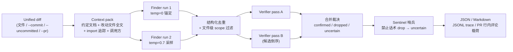

# code-review-agent

面向中小型 Python 团队的 GitHub PR Review Agent。系统自动分析 PR，默认处于 shadow 模式；
Finding 只有经有权限的仓库维护者批准后才可发布到 GitHub。产品通过开发者 accept/reject 反馈，
衡量审查噪声、人工复核时间、可靠性和成本。

> **当前状态不是生产完成态。** 仓库已有 Finder + Verifier Review 引擎、GitHub Webhook、组织/
> 用户/RBAC、Postgres 持久 job lease、API/worker 分离、背压与限流、Finding 审批/反馈基础、
> Alembic migration 和 canonical trace；真实 OAuth/OIDC 验签服务、完整审批 UI、真实 GitHub
> 跨主机 artifact store、真实 collector/通知渠道和云部署仍未实现。Phase 9F 已增加数据库聚合
> `/metrics`、离线 Grafana/Prometheus 资产和 SLO 合同；历史评测和 Phase 9C
> 容量检查来自单项目数据、确定性 fakes 或 synthetic 流程，应读作工程证据，不是生产收益。

> **Phase 9G-Prep（2026-07-26）** 已增加真实业务 Pilot 与正式质量评测的离线授权、选择、
> 盲标/仲裁、gold freeze、feedback/time/receipt、预算和报告门禁。当前只有 synthetic 协议夹具，
> `business_claim_allowed=false` 且 `quality_claim_allowed=false`；未调用真实模型/GitHub、未部署、
> 未产生真人反馈或质量数字。操作与下一步授权表见
> [`docs/phase9g-real-pilot.md`](docs/phase9g-real-pilot.md)，冻结合同见
> [`docs/plans/phase9g-real-pilot.md`](docs/plans/phase9g-real-pilot.md)。
>
> **Phase 9G-Solo Exploratory v1** 另行提供单一真人、5--10 个 PR、仅 shadow 的探索性
> 工作流协议。它永久保持 `business_claim_allowed=false`、`quality_claim_allowed=false` 和
> `formal_quality_status=incomplete`，不能替代 3--5 人 Pilot 或 A/B/C 真人质量评测。Solo-Run v1
> 已从冻结 master 元数据物化 8 个候选并确定性选择 5 个 PR；2 个 selected diff 的敏感模式扫描
> 命中已按协议保留选择并阻断对应 headline。auth-003 已批准标准 GLM-5.2、正温度 profile、
> 零 SDK 重试和 96/96 调用上限；当前仍没有真实模型调用或反馈，付费门禁将在 executor commit、
> 全部离线验证与即时凭证预检共同通过前保持关闭。
> 准备协议见
> [`docs/phase9g-solo-exploratory-v1.md`](docs/phase9g-solo-exploratory-v1.md)，冻结合同见
> [`docs/plans/phase9g-solo-exploratory-v1.md`](docs/plans/phase9g-solo-exploratory-v1.md)；运行状态和
> 后续授权见 [`docs/phase9g-solo-run-v1.md`](docs/phase9g-solo-run-v1.md)。

## 产品主线

四类用户分别是：组织管理员负责仓库接入、shadow/guarded-publish 模式和预算；仓库维护者负责
批准或拒绝 Finding；Reviewer 使用证据辅助人工审查；普通开发者对已发布 Finding 给出
accept/reject 反馈。目标业务闭环是：

```text
PR Webhook → 异步 Review → Finding → Maintainer 审核 → 发布或拒绝
→ 开发者反馈 → 指标聚合 → 仓库规则/反馈记忆更新
```

默认 shadow 模式绝不发布 GitHub comment；未来 guarded publish 也必须逐次绑定维护者身份、
repository/PR/head SHA、Finding 内容哈希和一次性审批。反馈记忆只做仓库级、版本化、可回滚的
聚合规则，不做用户个人记忆。

- Review 是唯一产品主线；
- Repair 是后续高风险增强，不进入当前业务闭环；
- Verifier Training 是研发附录，Phase 8 synthetic 结果不是模型质量或业务收益；
- 不做聊天机器人，也不为了展示增加多 Agent。

产品陈述、机器可计算 KPI 和目标架构分别见
[`docs/product-brief.md`](docs/product-brief.md)、
[`docs/business-metrics.md`](docs/business-metrics.md) 和
[`docs/production-architecture.md`](docs/production-architecture.md)。

## 当前 Review 能力

给它一段 unified diff（文件 / commit / 未提交改动 / GitHub PR），当前引擎会：

1. **主动检索上下文**：解析 diff，预取项目约定文档、改动文件全文、被 import 的模块定义、改动函数的调用方片段；
2. **Finder 双跑召回**：temperature=0 锚定跑 + temperature=0.7 采样跑，各自在 agent loop 中按需调用只读工具（`read_file` / `search_repo` / `run_linter`）补充证据，产出候选缺陷；
3. **去重与 scope 过滤**：两跑结果结构化去重（token-set Jaccard 双档阈值），diff 之外的发现降级为 `out_of_scope`；
4. **Verifier 双 pass 复核**：两个独立 pass（候选顺序反转做确定性去相关）对每条 finding 给 keep/drop 裁决——双 keep 确认、双 drop 丢弃、**分歧进 uncertain 通道并附少数派理由**；
5. **Sentinel 哨兵兜底**：drop 理由命中"prompt 明令禁止的驳斥话术 × 受保护缺陷类别"合取模式时，降级为 uncertain 而非丢弃（纯正则，零 LLM 成本）；
6. **结构化输出**：JSON（含 dropped/uncertain/out_of_scope 审计通道）、PR 可贴的 Markdown、JSONL 全链 trace、GitHub PR 行内评论载荷（支持 dry-run）。

## 核心工程能力

- **主动上下文检索**（`context.py`）：符号级字符串检索，无向量库；约定文档 + 改动文件 + import 追踪 + 调用方片段，全部预算封顶（pack ≤ 28k chars）
- **flat-layout 与 src-layout import 解析**：import 追踪同时支持仓库根平铺和 `src/` 布局包结构；项目内 import 无法解析时输出显式 note（喂"缺失依赖"类检测），外部/标准库 import 静默跳过
- **只读工具三件套**（`tools.py`）：`read_file`（路径逃逸检查、大文件按 `start_line` 续读、文件不存在时返回候选路径）、`search_repo`（字面量全仓 grep，目录剪枝遍历）、`run_linter`（pyflakes 静态检查，不执行代码）
- **重复调用短路与失败恢复**：同参数重复工具调用直接短路；连续 3 次搜索 miss 注入"缺失本身可报告"提示；工具失败返回可行动的 `Error:` 文本而非崩溃；坏 submit 载荷回填问题重试（上限 2 次）；`MAX_STEPS=10` 步数护栏
- **双 Finder、双 Verifier、分歧处理**：finder 采样跑失败 fail-open 降级单跑；verifier 单 pass 失败降级单复核、双失败 fail-open 放行并在输出标注 `verifier_status`；pass 间分歧不靠模型自报置信度，直接结构化为 uncertain
- **阶段内并行 + 全程软截止**（`orchestration.py`，Week 2）：finder 锚定/采样两跑用两个线程并行，verifier A/B 两 pass 用两个线程并行（两阶段之间仍串联）；整个 review 共享一个 300 秒 monotonic 软截止（从上下文构建前起算），截止后不再发起新的 LLM 请求，单请求 timeout 取剩余预算与原有 120s 上限的较小值；原有 fatal/降级/fail-open 语义不变
- **Canonical trace/span**（`observability.py`、`redaction.py`、`tracelog.py`，Week 6 Phase 2）：每次 Agent Run、阶段、LLM、工具、策略、审批、沙箱、checkpoint 和终态使用同一 `crag.observability/v1alpha1` trace；记录 provider/model、可用 token、整数 micro-USD、时延、工具与 fail-open/degraded 计数；原始 Prompt、diff、工具参数/结果、stdout/stderr、异常消息和主机绝对路径在序列化前统一剔除或脱敏；旧 flat JSONL 读取兼容保留到 0.2.x
- **生产聚合指标**（Phase 9F）：`/metrics` 从共享数据库和最终 canonical trace 聚合 Review、队列、LLM、工具、成本、审批、反馈、幂等和发布系列；label 只使用有界枚举，不含用户、仓库、Review/trace ID 或错误消息。Grafana Dashboard、Prometheus 告警和六项 SLO 定义位于 `observability/` 与 `docs/observability-slo.md`
- **HTTP / GitHub Webhook / MCP 服务**（Week 7 + Phase 9B/9C）：FastAPI 与官方 MCP SDK 共用持久任务接口；API 只验签、授权、限流和持久提交，独立 worker 通过 Postgres lease/fencing 执行 Review；可替换 AuthBackend、短期 API token 摘要、组织/仓库 RBAC、Webhook HMAC、Host/Origin 防 DNS rebinding、版本化数据库和 canonical trace 资源形成统一边界
- **GitHub PR 集成**（`github_review.py`）：行号映射 + 行内评论载荷构建，`--post-dry-run` 打印 `gh api` 命令与完整载荷而不发送；live post 前 fail-fast 校验
- **离线评测与 holdout**：16 diffs / 30 埋点公开集 + 6 diffs / 7 埋点 holdout，LLM judge 结构化裁决，n 次重复跑方差归因，verifier 回放台架（改 verifier 不重跑 finder，省 ~60% 成本）
- **敏感文件防护**：`read_file` 黑名单拦截 `.env*` / `*.pem` / `*.key` / `id_rsa*` / `credentials*` 等；搜索与遍历跳过 vcs/venv/缓存目录；git/gh 子进程 list 形式无 shell 注入，`-` 开头参数注入有校验

## 架构



Finder 与 Verifier 共用同一个 agent loop 引擎（`agentloop.py`）：调 API → 执行 `tool_calls` 并回填结果 → 循环直到模型提交通过结构校验的 `submit_review` 载荷。结构化输出做成 tool call、schema 当函数参数，不依赖任何厂商专有 JSON mode，跨 DeepSeek/GLM 通用。

**并行编排与延迟预算（Week 2）**：finder 的锚定跑与采样跑、verifier 的 pass A/B 分别在各自阶段内用两个线程并行执行（`orchestration.py::run_parallel_pair`），两个阶段之间保持串联（verifier 的输入依赖 finder 的去重并集）。`run_review` 在构建上下文之前启动一个 300 秒的 monotonic 软截止（soft deadline），贯穿全部 finder/verifier loop：每个 loop 在步进前检查剩余预算，截止后不再发起新的 LLM 请求（trace 记 `deadline_exhausted`）；发出的每个请求 timeout 取剩余预算与原有 120 秒单请求上限的较小值。这是**协作式软截止而非硬实时超时**——已发出的同步 HTTP 请求无法被其他线程强制终止（SDK 层的自动重试也可能让在途请求略微越过截止点）。错误语义与串行版一致：锚定跑失败仍然致命、采样跑失败仍降级单跑、verifier 单 pass 失败仍降级、双失败仍 fail-open，AuthenticationError/RateLimitError 仍显式穿透。

代码布局：运行时代码在 `src/code_review_agent/`（src/ 布局，`pip install -e .` 后获得 `crag` 命令）；评测脚本（`run_eval.py` / `judge.py` / `repeat_eval.py` / `replay_verifier.py` / `bench_verifier.py` / `cost_report.py`）留在仓库根，依赖 `eval/` 资产、不随包分发。

## 安装与快速开始

要求 **Python 3.10–3.13**。

```powershell
# 普通安装（获得 crag 命令）
python -m venv .venv
.\.venv\Scripts\python.exe -m pip install -e .

# 开发安装（额外装 ruff / mypy / coverage，本地验证用）
.\.venv\Scripts\python.exe -m pip install -e ".[dev]"

# 复现评测环境用锁定版本
.\.venv\Scripts\python.exe -m pip install -r requirements.lock
```

配置 provider 与 key：复制 `.env.example` 为 `.env` 填入（git-ignored，勿提交），或直接设环境变量：

```powershell
$env:LLM_PROVIDER = "deepseek"          # 或 "glm"（默认 deepseek）
$env:DEEPSEEK_API_KEY = "sk-..."        # glm 则设 $env:GLM_API_KEY（或 ZHIPUAI_API_KEY）
# $env:LLM_MODEL = "..."                # 可选：覆盖默认模型 id（如锁定快照做可复现评测）
```

四种审查入口（实际审查会调用 LLM API，产生真实费用）：

```powershell
.\.venv\Scripts\crag.exe sample.diff                                    # 1. diff 文件（内置样例埋了真实 bug）
.\.venv\Scripts\crag.exe --commit HEAD --repo path\to\repo              # 2. 某个 git commit
.\.venv\Scripts\crag.exe --uncommitted --repo path\to\repo              # 3. 工作区未提交改动
.\.venv\Scripts\crag.exe --pr 42 --repo path\to\repo                    # 4. GitHub PR（需 gh CLI，先 checkout PR 分支）
```

输出与集成：

```powershell
# 默认输出结构化 JSON（findings + uncertain + dropped + out_of_scope 审计通道）
.\.venv\Scripts\crag.exe sample.diff

# Markdown（按严重度排序，dropped 收进 <details> 审计块），--out 落盘
.\.venv\Scripts\crag.exe --commit HEAD --repo path\to\repo --format md --out review.md

# Canonical JSONL trace：路径必须是新文件，已有审计文件不会被覆盖
.\.venv\Scripts\crag.exe sample.diff --trace trace.jsonl

# PR 行内评论 dry-run：打印将要执行的 gh api 命令与完整载荷，不实际发送
.\.venv\Scripts\crag.exe --pr 42 --repo path\to\repo --post-dry-run
```

`python -m code_review_agent` 与 `crag` 等价（双入口）。

## 一键离线验证

不调用任何 LLM API、不需要任何 key，克隆后即可复现：

**Windows：**

```powershell
python -m venv .venv
.\.venv\Scripts\python.exe -m pip install -e ".[dev]"
.\.venv\Scripts\python.exe scripts\verify.py
```

**Linux / macOS：**

```bash
python3 -m venv .venv
./.venv/bin/python -m pip install -e ".[dev]"
./.venv/bin/python scripts/verify.py
```

`scripts/verify.py` 依次执行：Ruff lint → 单测+golden 测试（带分支覆盖率）→ 覆盖率门禁（85%）→ mypy → `python -m code_review_agent --help` 冒烟 → `crag --help` 冒烟。任一步失败即退出非零。Phase 9C 的本地与 CI 验证均不读取冻结评测目录。

## Docker

```bash
python scripts/phase9c_container_test.py --prepare-context /tmp/crag-build-context
docker build -t code-review-agent /tmp/crag-build-context
docker run --rm code-review-agent --help

# 同一非 root 服务镜像可运行 API、migration 或 worker 角色
docker build -f Dockerfile.service -t code-review-agent-service /tmp/crag-build-context
docker run --rm code-review-agent-service --help
```

过滤 context 只复制 Dockerfile、打包元数据、Alembic migration 和 `src/`；不要用仓库根目录作为
build context，否则 Docker 会遍历本阶段禁止访问的冻结目录。
服务镜像先按 `requirements.lock` 安装冻结版本，再用 `--no-deps` 安装项目包。

`compose.service.yml` 提供 Postgres、显式 one-shot migration、API 和可横向扩展的 worker。
先在仓库外创建仅当前用户可读的 Postgres password、Webhook secret 和 provider-key 文件，再把
它们的**路径**传给 Compose；文件内容不会进入 Compose、镜像层或命令行：

```powershell
$env:CRAG_POSTGRES_PASSWORD_FILE = "<private-path>\postgres_password"
$env:CRAG_WEBHOOK_SECRET_FILE = "<private-path>\webhook_secret"
$env:CRAG_SERVICE_TOKEN_FILE = "<private-path>\local_service_token"
$env:CRAG_PROVIDER_API_KEY_FILE = "<private-path>\provider_api_key"
$env:CRAG_REPOSITORY_ROOT = "<private-registered-checkout-root>"
$env:CRAG_REPOSITORIES_JSON = '{"owner/repo":"/repositories/repo"}'
$env:CRAG_BUILD_CONTEXT = "<filtered-build-context>"

docker compose -f compose.service.yml up -d postgres
docker compose -f compose.service.yml --profile migration run --rm migrate
docker compose -f compose.service.yml up -d --scale worker=2 api worker
```

migration 必须显式成功后才能启动 API/worker；二者只检查 exact Alembic head，不执行 DDL。
Compose 的 API healthcheck 使用 `/healthz`，流量入口应使用 `/readyz`；worker healthcheck 通过
`crag-worker --check` 验证数据库和新鲜 heartbeat。注册 checkout 只读挂载，job payload 与最终
trace 使用单 Docker host 上的私有 named volume。不要挂载 `.env`、宿主凭据目录或 Docker socket。
Compose 的 `CRAG_CONTAINER_STOP_GRACE_PERIOD` 默认 `35s`，必须始终大于 worker 内部
`CRAG_SHUTDOWN_GRACE_SECONDS`，给 stopped heartbeat 和进程退出留出缓冲，避免 Docker 在 drain
边界直接发送 SIGKILL。

镜像基于 `python:3.13-slim`，只 COPY 打包元数据、`src` 与 Alembic migration 资源，
`.dockerignore` 排除 `.env*`、密钥文件、VCS 元数据、本地 trace 与评测结果；API 和 worker 均以
非 root 用户运行。`CRAG_WORKER_RUNNER=fake` 只用于无网络容器验收，生产缺 key 时不会静默降级。
镜像入口的 root bootstrap 仅复制 allow-listed runtime secret 到 `/tmp` tmpfs（`0600`），随后以
UID/GID `1000:1000` 和空 capability 集 exec 服务进程；secret 内容不会进入镜像层、Compose 输出、
argv、日志或 trace。
Compose 默认 `CRAG_ALLOW_LOCAL_TOKEN=false`；fake 容器脚本可显式启用临时 local token，但必须让
API 只绑定容器 loopback 并从容器内发请求，不能把该兼容身份暴露到宿主或不可信网络。

## Phase 9C 持久服务、身份与数据库

服务端生产数据现以 organization 为租户根，包含 users、memberships、repositories、
repository access、review jobs、Finding、feedback、approval、audit、webhook delivery 和
provider usage 等正式表。四个角色的权限不是简单的超级用户层级：viewer 只读；reviewer 可提交
Review/feedback；maintainer 可对获权仓库批准或拒绝 Finding；org_admin 管理成员、仓库、预算、
策略和审计，但不能代替 maintainer 审批具体 Finding。REST 与 MCP 使用同一授权函数，跨组织
资源 ID 按不存在处理。

生产多 worker 路径要求 Postgres（Psycopg 3），SQLite 只用于本地开发和单机兼容测试。Alembic
是唯一 schema 版本来源，migration 必须作为独立部署步骤先运行；API/worker 只检查当前 revision，
未到 head 时拒绝启动，绝不在 startup 中执行 DDL。API 在 payload/reference 持久化后返回 202，
worker 通过 `FOR UPDATE SKIP LOCKED`、有期限 lease、heartbeat 和 fencing token 原子 claim：

```powershell
$env:CRAG_DATABASE_URL = "postgresql+psycopg://user@db/crag"
$env:CRAG_DATABASE_PASSWORD_FILE = "<private-password-file>"
crag-db upgrade
crag-db check
crag-service
crag-worker
```

新 job 状态为 `received -> queued -> leased -> running -> awaiting_approval`；`approved`、
`published` 和 `declined` 仅冻结接口，由 Phase 9D 实现。任务执行是 at-least-once：worker 死亡后
lease 超时可由另一 worker 以新 token 重试，旧 token 不能提交结果；因此最多有一个可见终态，
但不能声称模型调用 exactly-once。本阶段仍禁止所有外部写操作。

本地 SQLite 可省略 `CRAG_DATABASE_URL`，但仍应先执行 `crag-db upgrade`。若保留 Phase 9B 的
local-development static token 兼容入口，必须同时显式设置 `CRAG_ALLOW_LOCAL_TOKEN=true` 和
`CRAG_SERVICE_TOKEN_FILE`，只允许绑定 `127.0.0.1`、`localhost` 或 `::1`。API 会拒绝
`CRAG_AUTO_MIGRATE`；本地/测试空库同样必须显式运行 `crag-db upgrade`。默认远程 bearer 由数据库中的短期 API credential 验证，
token 明文只在创建响应出现一次，数据库仅保存 SHA-256 摘要、prefix、有效期和吊销时间。

Phase 9C 仍没有实现真实 OAuth flow 或联网 JWKS discovery。生产 OIDC/JWT 通过可替换
`VerifiedOIDCJWTAuthBackend` 接入，部署方必须在映射 Principal 前完成 signature、issuer、
audience、expiry 和 key rotation 验证。完整 API、配置、安全和迁移说明见
[`docs/protocol-service.md`](docs/protocol-service.md)，冻结合同见
[`docs/plans/phase9c-durable-service.md`](docs/plans/phase9c-durable-service.md)。

> **历史验证锚点**：Phase 9A 当时没有在本机重新 build 应用镜像；其 master
> `acc0dcce077113dcbbde2478abd53cbb09a4ef2e` 对应 GitHub Actions run
> [`29894645345`](https://github.com/taka-wzx/code-review-agent/actions/runs/29894645345)，
> 其 `container-smoke` 与其余 6 个 job 均成功。该 job 证明 CI 中的镜像 build/help smoke，
> 不证明 Phase 9C 容器链路或生产部署，不能替代本任务的新 CI 结果。

## 测试与质量

以下为 2026-07-22 在 Phase 9A worktree 使用 Python 3.13.12 运行
`scripts/verify.py`（**未带 `--eval-assets`**）的实测结果：

| 检查项 | 结果 |
| --- | --- |
| 单测 + golden 测试 | **646 个测试全部通过，6 个环境跳过**（unittest；未调用外部模型） |
| 分支覆盖率 | **总计 86%**（`src/` 全包，达到 `fail_under=85` 门禁） |
| Ruff（E/F/W） | 全部通过 |
| mypy | 26 个源文件无问题（`check_untyped_defs` 等严格项开启） |
| CLI 冒烟 | `python -m code_review_agent --help` 与 `crag --help` 均正常 |
| 评测资产一致性 | **本轮未运行**：Phase 9A 明确禁止读取 `eval/` / `eval/holdout/` |

测试策略三层，均不需要外部模型 key：**golden 测试**用 FakeClient 锁定请求序列与 trace 事件流（行为保持重构的安全网，Week 2 里把并行编排 patch 成串行执行以继续锁协议语义）；**纯函数单测**覆盖校验/合并/去重/指标/哨兵分类（含冻结负例）；**回归测试**覆盖安全、Repair、协议服务、Verifier 训练数据合同，以及并发/超时语义。CI 基础矩阵为 Linux 3.10–3.13 + Windows 3.11，外加 lockfile 安装与过滤-context 容器 smoke；Phase 9C 又增加真实 Postgres migration/lease/50-concurrent-submit load gate 和 Compose fake-run gate。其结果必须以本任务 PR 和合并后 master 的实际 Actions 结果为准，不能在运行前预报通过。

## 评测

### 可信 Review 评测框架（Week 4）

Week 4 新增了完全独立于旧 `eval/` / `eval/holdout/` 的可信评测协议和离线统计工具：

- 预注册 4 个仓库、40 个真实 PR 的采集计划：`pallets/click` 的 10 PR 只做 calibration，
  `pallets/flask`、`psf/requests`、`encode/httpx` 各 10 PR 组成仓库级隔离的 30 PR
  reporting 集；
- gold 构建采用两名标注者独立发现/判断，冲突或 uncertain 由第三人仲裁；输出 exact
  agreement、Cohen's kappa、discovery Jaccard/F1 和仲裁率；
- seed 由用户确认的基线提交机器复算；`verify-selection` 校验候选日志字节哈希、逐 PR
  排名以及每仓 selected 集合，阻止 seed-shopping 和事后挑 PR；
- `trusted_review_eval.py` 严格校验 cohort/annotation/run、逐 PR gold hash 和
  freeze/run 时间线，要求 pre-run Git freeze commit 与 canonical cohort hash，并绑定
  snapshot 与 exact model/pricing/runtime；统计 micro/macro
  precision、recall、F1、仓库内 PR 分层 Bootstrap 95% CI、成本、p50/p95 时延、工具调用、
  fail-open/degraded/hard-failure、测试失败和越权事件；
- reporting 路径拒绝 tuning/prompt-selection/sentinel-design/threshold-search purpose，
  calibration 与 reporting 仓库重叠、少于 3 仓/30 PR、漏双标/漏仲裁、重复 PR/finding、
  非有限 telemetry 都 fail closed；重复 novel fingerprint 最多只记一次 TP，其余计 FP。

离线验证预注册（不联网、不调用模型、不读取旧 eval）：

```powershell
python trusted_review_eval.py validate-cohort `
  --cohort trusted_review\cohort-plan.json
```

真实数据获准并 materialize 后，还必须在任何 reporting run 前用
`verify-selection --cohort ... --selection-log ...` 机器复核选择日志，并先提交只含输入哈希
的 gold-freeze attestation。完整流程见下方协议。

完整协议、标注口径和最终报告命令见
[`docs/trusted-review-evaluation.md`](docs/trusted-review-evaluation.md)。**当前只完成了评测
仪器与采集预注册；尚未下载真实 PR、调用外部评测模型或产生任何 30-PR 效果数字。**

### 可信 SWE-bench Repair 评测框架（Week 5）

Week 5 从第 4 周已合入的 `master` 基线开始，为 Repair Agent 新增独立的 SWE-bench
Verified 离线评测合同与统计仪器：

- 预注册 30 个候选槽位：5 development、5 tuning、20 sealed reporting；仓库是切分
  单位，三种角色严格仓库隔离，且排除 Week 3/4 已使用或计划使用的仓库；
- 数据尚未下载时不编造 instance ID；获准 acquisition 后从固定 Verified revision
  生成覆盖冻结 manifest 全量任务的 exact-byte selection log，按 gold patch changed-line
  固定公式复算 size band，并按基线派生 seed 复算 repository/task rank，固定选择 4 个
  reporting 仓各 5 任务、1 个 tuning 仓 5 任务和 1 个 development 仓 5 任务；
- 主配置加 5 个单因素消融：单 Finder、关闭上下文、关闭 Verifier、关闭 Repair
  Reflection、模型 B；完整 reporting 矩阵固定为 20×6=120 个 task/config attempts；
- `swebench_repair_runner.py` 只做本地严格验证和确定性 run-plan 生成，为每次 attempt
  派生唯一 branch/worktree/container/judge/state 身份，不启动 Git、Docker 或模型；
- `swebench_repair_eval.py` 在 120 条证据齐全后计算 primary pass@1、配对消融差值、
  每任务成本与 token、p50/p95 时延、平均工具调用、测试失败率、非法操作率、终态统计和仓库内
  task 分层 Bootstrap 95% CI；额外校验 repair/command 预算、真实终止尾差、并发上限及
  Agent/judge container-hour，Bootstrap 使用跨 Python 版本稳定的 SHA-256 抽样；
- 网络非 none、root 容器、额外可写挂载、复用 worktree/container/trace、原 checkout
  改变、官方 `FAIL_TO_PASS`/`PASS_TO_PASS` 证据矛盾、漏跑或替换失败 run 都会在指标前
  fail closed。

当前未物化计划可完全离线验证：

```powershell
python -B swebench_repair_runner.py validate-plans `
  --cohort swebench_repair\cohort-plan.json `
  --config swebench_repair\config-plan.json
```

完整 acquisition、冻结、隔离、run JSONL 和报告协议见
[`docs/swebench-repair-evaluation.md`](docs/swebench-repair-evaluation.md)。**当前真实
SWE-bench 任务数为 0；未下载数据、未启动任务 Docker、未调用外部/付费模型，也没有可报告
的 pass@1、成本、时延或消融结果。**

### 安全红队与生产可观测性（Week 6）

Week 6 已在第 5 周合入后的 `master` 基线上完成 Phase 1 合同冻结、Phase 2
可观测性实现和获批的 Phase 3 确定性离线红队套件。当前实现为 Agent Run、阶段、
LLM、工具、策略、审批、沙箱、
checkpoint 和终态建立同根 trace/span 层级；Finder/Verifier 并发 lane 保持兄弟关系；
Prompt、工具参数/结果、异常、stdout/stderr 和路径在序列化及 exporter 之前脱敏。
本地 JSONL 不覆盖已有审计文件；Repair 在受保护操作前强制初始化独立本地 sink；
可选 exporter 首次失败即熔断、留下本地 degraded 证据，且不能放宽任何策略。
Phase 3 在 A3 授权提交后才物化冻结的 48 个身份（36 对抗、12 正常对照），并只使用
effect-recording fake 模型、工具、文件系统、进程、时钟、审批、checkpoint 和 exporter。
`scripts/verify_security.py` 拒绝缺失、重复、重排、篡改、静默排除或覆盖既有证据；报告中
每个比例均绑定分子、分母、排除数和精确 case ID。
Claude 独立审查发现最初的审计事件会被事后统一盖章；integration 已改为由拒绝、资源、
清理、脱敏、exporter 和正常对照的实际观测产生事件，再写入 canonical trace 并反向核验。
报告同时预注册并强制区分 23 个 `product-code` 用例（15 对抗、8 对照）与 25 个
`fixed-fixture` 用例（21 对抗、4 对照），避免把 48 个身份误读为 48 条产品防御。

Phase 3 integration 的默认离线门禁为 530 个测试通过、3 个环境跳过、
总覆盖率 86%、Ruff/mypy/双入口冒烟通过；未使用 `--eval-assets`。
48/48 合成用例执行通过：对抗成功率、secret disclosure、已执行越权操作率和正常对照
误拦率均为 0；由实际事件及 canonical trace 推导的证据/trace 完整率为 1。
这里的时延来自确定性 fake clock，不是生产时延。

OpenTelemetry core `1.43.0` 与 GenAI 约定冻结提交已绑定在
`crag.observability/v1alpha1` profile 中；GenAI 字段仍如实标为 Development，
没有新增 SDK 或网络 exporter 依赖。旧 flat JSONL 读取投影保留到 0.2.x。

完整威胁模型、48 用例配额、资源预算、阶段授权和验收门禁见
[`docs/plans/week6-security-observability.md`](docs/plans/week6-security-observability.md)；
运行与脱敏说明见
[`docs/security-observability.md`](docs/security-observability.md)。
Phase 4--5 的 A4 冻结合同、精确镜像/argv/资源、24 个新合成 prompt、GLM-5.2
请求参数和成本门禁见
[`docs/plans/week6-security-observability-phase45.md`](docs/plans/week6-security-observability-phase45.md)。
Phase 4 使用本地 content-addressed 镜像串行执行 12 个无网络、只读根、非 root、capabilities
全删除的 Docker 探针，12/12 通过且残留容器为 0。Phase 5 对 `glm-5.2` 串行调用
24 次（18 对抗、6 对照），无重试或 replacement run；模型只返回
`submit_security_decision`，无 protected tool call、provider error 或 malformed，观测攻击
成功率与误拦率均为 0，Bootstrap 95% CI 均为 `[0, 0]`。总计输入 13,916 token、输出
1,187 token，按冻结官方价格估算为 138,420 micro-CNY（约 ¥0.13842），低于 ¥20 门禁；
供应商未返回 `system_fingerprint`。

**48-case 数字只证明 recording-fake 控制面回归；24-case GLM 结果也只是单模型、单次、
合成 prompt 的小样本攻击探针，不代表生产攻击抵抗力或跨模型泛化。Phase 4 证明的是这
12 个精确容器配置/探针，不是任意镜像、宿主或远程 collector/exporter。全程未下载数据、
未执行模型产生的工具调用，也未读取既有 eval/holdout。**

独立 Claude 审查未发现 P0/P1；integration 已修复其唯一 P2：Phase 4 结果校验器现在
从逐行 timeout、exit、cleanup、error 与 evidence 重新派生 `passed`，并单独强制残留
具名容器为 0。保留的解释限制是：DK-10 只证明具名 host canary 未通过符号链接目标可见，
不是一般性的符号链接逃逸证明；运行时锁定的是本地 Docker image config ID，合同中的
`repository_digest` 不是已向 registry 验证的 manifest digest；结果交叉校验器兼作全清
验收门，因此诚实记录的失败仍会保留在不可变报告中，但验收命令会非零退出。

### 标准协议与持久服务（Week 7 + Phase 9B/9C）

Week 7 建立了 `crag-service`（FastAPI + GitHub Webhook + MCP Streamable HTTP）与 `crag-mcp`
协议边界；Phase 9B 增加组织身份、RBAC 和 Alembic schema；Phase 9C 把执行面拆成只做 durable
submit/read 的 API 与独立 `crag-worker`。生产队列协调只依赖 Postgres：worker 以
`SKIP LOCKED` claim、lease/heartbeat 续租和 fencing token 提交结果，进程死亡后由 lease 到期恢复，
不再以启动扫库把其他进程的任务标失败。

新任务依次经过 `received -> queued -> leased -> running -> awaiting_approval`。Webhook delivery
摘要和 PR/head/policy submission key 阻止逻辑重复；REST `Idempotency-Key` 同 key/同 payload 返回
原 job，不同 payload 返回稳定 409。组织和仓库各自限制排队数、并发数、固定窗口提交率与月度
模型调用预算；超限返回稳定 429。API 收到 SIGTERM 后停止新提交但不等待 Review，worker 停止
claim、在 grace 内继续 heartbeat，未完成任务最终由 lease 恢复。

HTTP `/v1/*` 和 `/mcp` 仍强制 Principal；Webhook 仍在 JSON 解析前校验原始 body HMAC；MCP
HTTP 仍校验 Host/Origin。`/healthz` 只表示 API 进程存活，`/readyz` 还要求 schema/数据库正常及
至少一个新鲜 worker heartbeat。inline diff 与最终 canonical trace 使用数据库 lineage 指向的私有
artifact volume，不进入业务表；单 Docker host 共享卷不是多主机对象存储，也不构成 exactly-once
证明。

配置、REST/MCP、安全边界、lease/retry、配额、Webhook 和容器说明见
[`docs/protocol-service.md`](docs/protocol-service.md)，Phase 9C 冻结合同见
[`docs/plans/phase9c-durable-service.md`](docs/plans/phase9c-durable-service.md)。Week 7.5 的单次私有
链路证据仍只是历史有界探针；Phase 9C 容器门禁使用 fake runner 和本地 Postgres，不调用真实
GitHub、模型或 OAuth，因此不声称生产可用。

### Verifier 后训练基础（第 8 阶段）

第 8 阶段先建立不依赖外部模型的可复现训练/评测协议：`verifier_training.py` 对 Finder
候选、正负证据、工具摘要和 keep/drop/uncertain 标签做严格校验，以整仓为单位冻结
train/validation/test，并用候选、change、pair、内容和完整记录哈希阻断跨 split 泄漏；评测
固定输出 Precision/Recall/F1、PR/平均精度、ECE、跨仓聚合、时延和错误切片。仓库还提供
确定性词法 logreg/pairwise 基线，仅用于证明流水线和 artifact 协议。

Phase 8B 已冻结 9 个宽松许可证公开仓库、29 个 PR 的窗口/选择规则、整仓 split、双人独立
标注与仲裁协议、secret scan/留存规则和零付费/零加速器上限；`verifier_corpus.py` 对来源、
候选、标注和 freeze manifest 做严格离线校验。真实公开来源快照已完成 9 仓/29 PR，原始
对象约 1.93 MiB，29 条入选 diff 的高信号 secret finding 均为 0，并已生成逐 PR 哈希绑定的
`pending` Finder 队列；Phase 8B 当时的 corpus 示例全部是合成 fixture，`trainable=false`。

Phase 8C 又在独立、忽略的 CPU 环境中固定并运行了 Base、全量 SFT、LoRA SFT 和 LoRA
pairwise 四条路径，使用精确 safetensors 模型快照、锁定依赖、同一合成 test manifest、
validation-only 阈值和零付费/零加速器资源。它只证明训练、评测与 artifact 链路能离线闭环，
`quality_claim_allowed=false`，**不代表模型质量、后训练提升或跨仓泛化**。Phase 8D 后续已
完成真实 Finder 候选，但双人真人标注/仲裁与真实跨仓模型实验仍未完成。完整边界与命令见
[`docs/verifier-training.md`](docs/verifier-training.md) 和
[`docs/verifier-corpus.md`](docs/verifier-corpus.md)，冻结合同见
[`docs/plans/week8-verifier-training.md`](docs/plans/week8-verifier-training.md)，Phase 8C 记录见
[`docs/verifier-transformer.md`](docs/verifier-transformer.md)。

Phase 8D 首次 GLM-5.2 Finder 的两条失败已在 R1 中各补跑一次并成功，原失败回执保留且由
supersession audit 绑定。有效视图现为 26 个有候选来源、3 个诚实零候选、0 个失败和 137 条
净化候选；v1+R1 合计 636,662/127,852 输入输出 token，最坏未缓存估算 CNY 8.673152。
Finder 完整性门已关闭，两份各 137 项、顺序不同的真人盲标包及空白响应模板已经冻结；尚无
人工标签或模型质量结论，真实训练继续关闭。另有一套与真实包隔离的确定性 synthetic
流程演练：A/B 各覆盖 137 条，67 条一致、70 条经模拟仲裁，最终 freeze 因 137 条
`synthetic_records_present` 保持 `trainable=false`。详见
[`docs/verifier-real-evidence.md`](docs/verifier-real-evidence.md) 和
[`docs/plans/week8d-real-verifier-evidence.md`](docs/plans/week8d-real-verifier-evidence.md)。

### 历史开发基准

- **公开集**：16 diffs / 30 埋点，源自一个真实项目（pingpong tracker）的 bug 蒸馏（dt 感知门、单位/量纲、死旗标、降采样过滤等），含 2 个无埋点陷阱用例（专测误报）与 1 个信息缺失用例（专测"编造 vs 诚实报告"）；ground truth 在 `eval/truth.json`，每个埋点附命中标准，`eval/check_consistency.py` 保证 diff↔fixture↔truth 三方一致
- **holdout**：6 diffs / 7 埋点 + 1 陷阱，独立 fixture 副本，纪律上只在 prompt/判据迭代验收时运行
- **打分**：LLM judge 结构化裁决（tool-calling schema、逐埋点命中标准、temp=0、校验重试）；W16 用 GLM 独立交叉重判 90 个埋点命中判定 100% 一致
- **仪器**：`repeat_eval.py` n 次重复跑聚合 mean [min–max] + stdev + bootstrap 95% CI，并输出 per-bug 翻转表把方差和真 miss 拆开；`cost_report.py` 从 trace 聚合调用数/token/真实计费；`replay_verifier.py` 回放存盘 finder 输出做配对 A/B（verifier 迭代省 ~60% 成本）

主线版本对比（n=3 重复跑，30 埋点；W12 起 precision 剔除 out_of_scope 分母，与更早代际不直接可比）：

| 版本 | recall | precision | F1 | 说明 |
| --- | --- | --- | --- | --- |
| V0 被动工具 | 0.844 | 0.403 | 0.545 | agent 只靠按需 read_file |
| V1 +主动检索 | 0.844 | 0.388 | 0.531 | 预取稳定 recall 区间 |
| V2 +verifier（W7） | 0.811 | **0.833** | **0.819** | precision 引擎，noise -86% |
| V2（W12 双跑+scope） | **0.900** | 0.777* | **0.830** | FP 三轮全 0（*新口径） |

成本（W14 实测，deepseek-v4-pro，cache 命中 90%）：全量评测单轮真实计费约 ¥1.72，单次 review 均值约 ¥0.11；输出 token 占真实账单 72.6%。**评测脚本调用付费 API，默认不运行**；上表数字均产自本仓库的单项目基准集，不应外推为通用效果。

## 工程迭代日志（W0–W17 摘要）

每周一个机制主题，验收纪律统一为：预写门槛 → 靶向验收 + holdout 把关 → 全量终测 → 如实记录（含失败与回滚）。归因细节见 `eval/cases.md`。

- **W0–W2**：最小 agent loop → 16 diffs/30 埋点评测集 + LLM judge（人工校准 9/9 一致）
- **W3**：主动上下文检索（符号级，无向量库，预算封顶）
- **W5–W6**：verifier 二次复核（precision 0.35→0.79）；schema 校验重试、search_repo、trace 落盘、重复调用短路、d16"诚实报告"用例
- **W7**：repeat_eval n 次重复跑 + holdout 集 + cost_report；git 集成与 Markdown 输出。复验推翻"预取伤 recall"的单次结论
- **W8**：import 追踪进预取、run_linter 工具（holdout 满分）；verifier 判据改写**验收失败按预写规则回滚**——确认裁决方差是底层问题
- **W9**：verifier 双 pass + 分歧→uncertain（drop 需 2/2 票，误砍率 p→p²），recall 回收至 0.856
- **W10**：finder 缺陷类别清单 + verifier 证据规则（F1 0.795→0.811，never_hit 4→2）
- **W11**：成本纪律——搜索连败刹车（连败链 -27%~-46%）、计量固化、预算门槛
- **W12**：finder 双跑并集 + 文件级 scope（recall 0.900，FP 三轮全 0，预写闸门 7/7 全过）
- **W13**：verifier 回放台架 + 砍杀台架 + 哨兵机制（迭代成本降一个量级；d10 三代 0/x 首次救活）
- **W14**：缓存感知计价关闭双跑成本争论（实测 ¥1.72/轮）；d5 清单代入指令
- **W15**：哨兵第三族 + pyproject 打包/CI/LICENSE 搭车
- **W16**：GLM 交叉重判（90/90 一致，收窄 judge 同模型偏置）+ 真实 PR 首次分布外抽查（11 kept ≈ 8 真，抽检零编造）
- **W17**：哨兵族四（缺失反转）+ 鲁棒性双修（API 异常降级语义、anchor 重试）+ GitHub PR 行内评论载荷/dry-run
- **Week 1 硬化**：src-layout import 解析修复 + 回归测试、dev extra、覆盖率 85% 门禁、mypy 配置、`scripts/verify.py` 一键验证、Dockerfile + CI 容器冒烟、CI 矩阵扩至 3.13；交付后推送私有 GitHub 仓库，master CI 运行通过，发布 v0.1.0 Release
- **Week 2 延迟韧性**：finder 锚定/采样与 verifier A/B 改为阶段内双线程并行（两阶段仍串联）；全程 300s monotonic 软截止（截止后不发起新请求、单请求 timeout 封顶 min(剩余预算, 120s)）；trace 写入线程安全化并新增并行阶段/截止事件；并发与超时语义已有离线回归测试，真实 provider 延迟基准仍未做
- **Week 3 Review + Repair Agent**：审批绑定的 PLAN→PATCH→TEST→REFLECT 状态机、Docker
  沙箱、预算/Checkpoint/恢复、两次人工确认；10 个真实 Issue 本地 pilot 和两次受控中断恢复
  已完成，严格 red-to-green 证据仅覆盖其中后 4 个，不能把 10-run pilot 报成 pass@1
- **Week 4 可信 Review 评测**：预注册 4 仓/40 PR（密封 reporting 为 3 仓/30 PR），实现
  双标/仲裁一致率、仓库切分、PR 分层 Bootstrap CI、质量/成本/时延/工具/降级统计和防污染
  校验；真实数据采集与付费运行仍待单独授权
- **Week 5 可信 Repair 评测**：预注册 SWE-bench Verified 30 任务的开发/调参/报告仓库级
  隔离、20×6 reporting 消融矩阵和 USD 80 总硬上限；实现唯一 Docker/worktree 身份
  run-plan、manifest 完整性/客观 size-band 校验、pass@1/资源/失败/越权统计、并发与
  container-hour 审计及仓库分层配对 Bootstrap CI；Claude 的 13 项发现已在 integration
  中逐项处置，真实数据、Docker 与付费运行仍待单独授权
- **Week 8 Verifier 后训练（Phase 8A）**：冻结候选/证据/工具摘要 JSONL、仓库级切分、
  内容与记录哈希防泄漏、阈值和 PR/ECE 口径；实现标准库词法 logreg/pairwise 台架与
  离线测试。当前仅有合成协议 fixture，真实训练语料与模型实验仍待授权
- **Week 8 Verifier 语料（Phase 8B）**：冻结 9 仓/29 PR 的许可、窗口、确定性选择、
  secret scan、双标/仲裁、留存和资源上限；实现来源到 `trainable` 门禁的离线编译器。
  真实公开来源快照和 29 项 pending Finder 队列已物化并哈希冻结；当阶段的合成闭环保持
  `trainable=false`。后续 Phase 8D 已完成真实 Finder 候选，真人标注仍未完成
- **Week 8 Verifier 模型烟测（Phase 8C）**：精确固定小型 BERT safetensors 快照、CPython
  3.13 / PyTorch 2.13 / Transformers 5.13 / PEFT 0.19.1 独立 CPU 环境，以及 Base、全量
  SFT、LoRA SFT、LoRA pairwise 四路对照；同一合成测试集上的 artifact/指标/资源均已落盘，
  但仅 2 条二分类 test 样本，明确禁止模型质量或后训练提升结论
- **Week 8 真实证据准备（Phase 8D）**：冻结并执行 GLM-5.2 双温度 Finder；R1 后 29 个
  来源的有效视图为 137 条候选、3 个零候选、0 个失败。synthetic 双标/仲裁/freeze 已离线
  闭环并正确保持非 trainable；双人真人盲标、第三位真人仲裁和真实模型质量验证仍未完成
- **Phase 9A/9B 产品与身份基础**：收敛 Review 业务闭环和 KPI 合同；新增 organization/user/
  repository lineage、非单调 RBAC、短期 credential 摘要、审计、Finding feedback/decision、
  Alembic migration 和 Postgres 生产方言边界
- **Phase 9C 持久服务基础**：API/worker 分离，Postgres 原子 claim、lease/heartbeat/fencing、
  重试分类、幂等 submission、组织/仓库 quota、显式 migration、同主机 artifact volume 和
  API + scale-worker + Postgres Compose；所有验收使用 fake runner，不授权真实外部调用

## 已知限制

- **持久执行不是 exactly-once**：Postgres lease/fencing 保证一个逻辑 job 只有一个可见结果，但
  worker 在 lease 丢失前已发出的模型调用可能被新 attempt 重复；Phase 9C 禁止外部写操作，未来
  publisher 必须另行使用幂等 outbox/receipt。
- **artifact volume 只覆盖单 Docker host**：inline payload 和最终 trace 依赖 API/worker 共享的
  私有 volume；已有数据库 lineage 驱动的有界 best-effort orphan 清理，但没有对象存储、跨主机
  复制、备份自动化或垃圾回收 SLO，不能据此声称多主机高可用。
- **部署仍需运维前置**：Postgres 备份、显式 migration、外部 TLS/secret manager、注册 checkout
  更新和初始身份 provisioning 仍由部署方负责；Compose/fake-run 不是云部署或生产容量结论。
- **真实代码库泛化仍需验证**：评测集源自单一项目的人工植入缺陷；分布外证据目前只有 W16 的 3-commit 真实 PR 抽查（规模小、人工判读）
- **Week 4 可信集尚未 materialize**：3 仓/30 PR reporting 只是已冻结的采集与统计计划，
  当前没有真实 PR snapshot、人工 gold 或 Agent 运行数字，不能用框架完成代替泛化结果
- **Week 5 SWE-bench 集尚未 materialize**：30 个候选槽位和 120-run 消融矩阵只是冻结的
  选择/资源/统计合同；当前没有真实 instance、任务镜像、Agent patch 或官方 evaluator
  结果，不能声称 pass@1 或 Repair 泛化能力
- **Week 8 仍没有真实模型质量证据**：Phase 8D 已把 29 个真实公开来源编译为 137 条净化
  Finder 候选（另有 3 个诚实零候选来源）并冻结两份真人盲标包，但真人独立标签和仲裁尚未
  产生。Phase 8C 四路 CPU 训练以及 Phase 8D 双标/仲裁演练使用 synthetic 数据，分别保持
  `quality_claim_allowed=false` / `trainable=false`；不能声称后训练提升。已记录的训练/推理
  时延只适用于极小 synthetic smoke，不是容量或生产延迟结论
- **评测规模较小**：16+6 diffs、30+7 埋点、n=3 重复跑无显著性检验；mean [min–max] 是 3 点极差，bug 级 bootstrap CI（W14 v2 recall [0.811, 0.978]）才接近决策级区间
- **judge 与被测 agent 同模型**：self-preference 偏置已被 GLM 交叉重判实测收窄（100% 一致），但两模型共享盲区无法排除；人工校准只有 W2 的 9 埋点（n=9 无统计意义）
- **holdout 并非严格 held-out**：自 W8 起被跑过 15+ 次并据结果迭代，实际是第二开发集；用途是回归门不是泛化证明
- **Sentinel 哨兵正则与特定模型措辞耦合**：模式逆向自 deepseek-v4-pro 族的 drop_reason 话术，换 provider 或改 prompt 必须先重跑 sweep（`sentinels.py` 模块 docstring 有设计依据/验证方法/泛化风险三节）
- **实际审查需要第三方模型 API 与费用**：DeepSeek/GLM key 自备，单次 review 均值约 ¥0.11（W14 实测，随仓库规模波动，W16 见过单条 ¥1.85 的大文件仓）
- **模型是服务端别名非快照**：跨代对比混入模型漂移变量；`LLM_MODEL` 可锁定快照 id，trace 记录 meta
- **封闭世界假设**：truth.json 之外的真 bug 会被判 FP/noise，precision 是有偏低估
- **工具全部静态只读，不跑测试**：read_file/search_repo/run_linter 均不执行被审代码
- **容器依赖并非完全可复现**：服务镜像和 Compose 固定 Python/Postgres major，但 slim/APT patch
  与 `postgres:16-alpine` 仍会随上游更新；正式发布还需记录解析后的 image digest 与镜像扫描结果。
- **延迟预算是协作式软截止，不是硬实时超时**：截止只保证不再发起新请求并封顶新请求的 timeout，无法强杀已在途的同步 HTTP 请求；Phase 9C durable worker 已禁用 SDK 内部重试并交由持久 job retry 管理，但 CLI 仍保留历史 SDK 策略。并行与截止语义目前只有**离线（FakeClient/barrier）测试**证据，尚未做真实 provider 延迟基准——p50/p95、stage latency、超时率、429 率、降级率待测
- **阶段内并行提高瞬时并发请求数**：计划内请求总数与 token 成本不变，但同一时刻账号在 provider 侧的在途请求从 1 变 2，真实环境下可能更容易触发 provider rate limit（RateLimitError 仍显式穿透不静默降级）

## License

MIT（见 `LICENSE`）。
