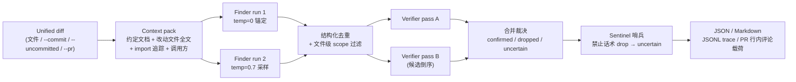

# code-review-agent

两阶段（**Finder + Verifier**）LLM 代码审查 Agent：**Finder 负责召回候选缺陷，Verifier 负责证据验证与过滤**，配套一套可复现的离线评测台架。走 OpenAI 兼容接口，provider 无关（目前支持 DeepSeek 与 GLM）。

> 定位说明：这是一个个人工程项目，用于系统性地实践 LLM Agent 的工具设计、编排机制与评测方法论。评测数字来自**单项目人工植入缺陷**的基准集，应读作工程迭代信号，而非行业通用 SOTA 或生产效果承诺。项目尚未发布公共 GitHub 仓库，无线上用户、无生产部署。

## 项目定位

给它一段 unified diff（文件 / commit / 未提交改动 / GitHub PR），它会：

1. **主动检索上下文**：解析 diff，预取项目约定文档、改动文件全文、被 import 的模块定义、改动函数的调用方片段；
2. **Finder 双跑召回**：temperature=0 锚定跑 + temperature=0.7 采样跑，各自在 agent loop 中按需调用只读工具（`read_file` / `search_repo` / `run_linter`）补充证据，产出候选缺陷；
3. **去重与 scope 过滤**：两跑结果结构化去重（token-set Jaccard 双档阈值），diff 之外的发现降级为 `out_of_scope`；
4. **Verifier 双 pass 复核**：两个独立 pass（候选顺序反转做确定性去相关）对每条 finding 给 keep/drop 裁决——双 keep 确认、双 drop 丢弃、**分歧进 uncertain 通道并附少数派理由**；
5. **Sentinel 哨兵兜底**：drop 理由命中"prompt 明令禁止的驳斥话术 × 受保护缺陷类别"合取模式时，降级为 uncertain 而非丢弃（纯正则，零 LLM 成本）；
6. **结构化输出**：JSON（含 dropped/uncertain/out_of_scope 审计通道）、PR 可贴的 Markdown、JSONL 全链 trace、GitHub PR 行内评论载荷（支持 dry-run）。

## 核心工程能力

- **主动上下文检索**（`context.py`）：符号级字符串检索，无向量库；约定文档 + 改动文件 + import 追踪 + 调用方片段，全部预算封顶（pack ≤ 28k chars）
- **flat-layout 与 src-layout import 解析**：import 追踪同时支持仓库根平铺和 `src/` 布局包结构；项目内 import 无法解析时输出显式 note（喂"缺失依赖"类检测），外部/标准库 import 静默跳过
- **只读工具三件套**（`tools.py`）：`read_file`（路径逃逸检查、大文件按 `start_line` 续读、文件不存在时返回候选路径）、`search_repo`（字面量全仓 grep，目录剪枝遍历）、`run_linter`（pyflakes 静态检查，不执行代码）
- **重复调用短路与失败恢复**：同参数重复工具调用直接短路；连续 3 次搜索 miss 注入"缺失本身可报告"提示；工具失败返回可行动的 `Error:` 文本而非崩溃；坏 submit 载荷回填问题重试（上限 2 次）；`MAX_STEPS=10` 步数护栏
- **双 Finder、双 Verifier、分歧处理**：finder 采样跑失败 fail-open 降级单跑；verifier 单 pass 失败降级单复核、双失败 fail-open 放行并在输出标注 `verifier_status`；pass 间分歧不靠模型自报置信度，直接结构化为 uncertain
- **JSONL trace**（`tracelog.py`）：llm 调用 / 工具调用 / submit 拒绝 / 裁决全事件流落盘，含 provider/model 元数据与 token 计量，支撑成本报表与回放归因
- **GitHub PR 集成**（`github_review.py`）：行号映射 + 行内评论载荷构建，`--post-dry-run` 打印 `gh api` 命令与完整载荷而不发送；live post 前 fail-fast 校验
- **离线评测与 holdout**：16 diffs / 30 埋点公开集 + 6 diffs / 7 埋点 holdout，LLM judge 结构化裁决，n 次重复跑方差归因，verifier 回放台架（改 verifier 不重跑 finder，省 ~60% 成本）
- **敏感文件防护**：`read_file` 黑名单拦截 `.env*` / `*.pem` / `*.key` / `id_rsa*` / `credentials*` 等；搜索与遍历跳过 vcs/venv/缓存目录；git/gh 子进程 list 形式无 shell 注入，`-` 开头参数注入有校验

## 架构



Finder 与 Verifier 共用同一个 agent loop 引擎（`agentloop.py`）：调 API → 执行 `tool_calls` 并回填结果 → 循环直到模型提交通过结构校验的 `submit_review` 载荷。结构化输出做成 tool call、schema 当函数参数，不依赖任何厂商专有 JSON mode，跨 DeepSeek/GLM 通用。

代码布局：运行时代码在 `src/code_review_agent/`（src/ 布局，`pip install -e .` 后获得 `crag` 命令）；评测脚本（`run_eval.py` / `judge.py` / `repeat_eval.py` / `replay_verifier.py` / `bench_verifier.py` / `cost_report.py`）留在仓库根，依赖 `eval/` 资产、不随包分发。

## 安装与快速开始

要求 **Python 3.10–3.13**。

```powershell
# 普通安装（获得 crag 命令）
python -m venv .venv
.\.venv\Scripts\python.exe -m pip install -e .

# 开发安装（额外装 ruff / mypy / coverage，本地验证用）
.\.venv\Scripts\python.exe -m pip install -e ".[dev]"

# 复现评测环境用锁定版本
.\.venv\Scripts\python.exe -m pip install -r requirements.lock
```

配置 provider 与 key：复制 `.env.example` 为 `.env` 填入（git-ignored，勿提交），或直接设环境变量：

```powershell
$env:LLM_PROVIDER = "deepseek"          # 或 "glm"（默认 deepseek）
$env:DEEPSEEK_API_KEY = "sk-..."        # glm 则设 $env:GLM_API_KEY（或 ZHIPUAI_API_KEY）
# $env:LLM_MODEL = "..."                # 可选：覆盖默认模型 id（如锁定快照做可复现评测）
```

四种审查入口（实际审查会调用 LLM API，产生真实费用）：

```powershell
.\.venv\Scripts\crag.exe sample.diff                                    # 1. diff 文件（内置样例埋了真实 bug）
.\.venv\Scripts\crag.exe --commit HEAD --repo path\to\repo              # 2. 某个 git commit
.\.venv\Scripts\crag.exe --uncommitted --repo path\to\repo              # 3. 工作区未提交改动
.\.venv\Scripts\crag.exe --pr 42 --repo path\to\repo                    # 4. GitHub PR（需 gh CLI，先 checkout PR 分支）
```

输出与集成：

```powershell
# 默认输出结构化 JSON（findings + uncertain + dropped + out_of_scope 审计通道）
.\.venv\Scripts\crag.exe sample.diff

# Markdown（按严重度排序，dropped 收进 <details> 审计块），--out 落盘
.\.venv\Scripts\crag.exe --commit HEAD --repo path\to\repo --format md --out review.md

# JSONL trace：llm/tool/submit/verdict 全事件流，供成本报表与回放归因
.\.venv\Scripts\crag.exe sample.diff --trace trace.jsonl

# PR 行内评论 dry-run：打印将要执行的 gh api 命令与完整载荷，不实际发送
.\.venv\Scripts\crag.exe --pr 42 --repo path\to\repo --post-dry-run
```

`python -m code_review_agent` 与 `crag` 等价（双入口）。

## 一键离线验证

不调用任何 LLM API、不需要任何 key，克隆后即可复现：

**Windows：**

```powershell
python -m venv .venv
.\.venv\Scripts\python.exe -m pip install -e ".[dev]"
.\.venv\Scripts\python.exe scripts\verify.py --eval-assets
```

**Linux / macOS：**

```bash
python3 -m venv .venv
./.venv/bin/python -m pip install -e ".[dev]"
./.venv/bin/python scripts/verify.py --eval-assets
```

`scripts/verify.py` 依次执行：Ruff lint → 单测+golden 测试（带分支覆盖率）→ 覆盖率门禁（85%）→ mypy → `python -m code_review_agent --help` 冒烟 → `crag --help` 冒烟 →（`--eval-assets` 时）eval/holdout 资产三方一致性校验。任一步失败即退出非零。

## Docker

```bash
docker build -t code-review-agent .
docker run --rm code-review-agent --help
```

镜像基于 `python:3.13-slim`，只 COPY `pyproject.toml`/`README.md`/`LICENSE`/`src`，`.dockerignore` 排除 `.env*`、密钥文件、VCS 元数据、本地 trace 与评测结果；容器内以非 root 用户启动 `crag` CLI。

> **验证状态如实声明**：当前 Windows 工作站未安装 Docker，镜像构建**未在本地验证过**。仓库的 CI 配置（`.github/workflows/ci.yml` 的 `container-smoke` job）会构建镜像并跑 `--help` 冒烟，但由于尚未创建远程 GitHub 仓库，**该 CI 尚未在 GitHub 上实际运行过**——Docker 构建当前状态为"等待 GitHub CI 验证"。

## 测试与质量

以下为 2026-07-15 在本机（Windows 11，Python 3.13 独立 venv）对当前提交实测的结果，非复制而来：

| 检查项 | 结果 |
| --- | --- |
| 单测 + golden 测试 | **178 个测试全部通过**（unittest，零 API 调用，0.36s） |
| 分支覆盖率 | **总计 95%**（`src/` 全包，门禁 `fail_under=85`） |
| Ruff（E/F/W） | 全部通过 |
| mypy | 13 个源文件无问题（`check_untyped_defs` 等严格项开启） |
| CLI 冒烟 | `python -m code_review_agent --help` 与 `crag --help` 均正常 |
| 评测资产一致性 | eval：16 diffs / 30 埋点一致；holdout：6 diffs / 7 埋点一致 |

测试策略三层，全部零 API 调用：**golden 测试**用 FakeClient 锁定请求序列与 trace 事件流（行为保持重构的安全网）；**纯函数单测**覆盖校验/合并/去重/指标/哨兵分类（含冻结负例）；**回归测试**覆盖 P0 安全修复、src-layout import 解析、CLI 参数路径与工具协议。CI（GitHub Actions，已配置待远程运行）矩阵为 Linux 3.10–3.13 + Windows 3.11，外加 lockfile 安装校验与容器冒烟。

## 评测

- **公开集**：16 diffs / 30 埋点，源自一个真实项目（pingpong tracker）的 bug 蒸馏（dt 感知门、单位/量纲、死旗标、降采样过滤等），含 2 个无埋点陷阱用例（专测误报）与 1 个信息缺失用例（专测"编造 vs 诚实报告"）；ground truth 在 `eval/truth.json`，每个埋点附命中标准，`eval/check_consistency.py` 保证 diff↔fixture↔truth 三方一致
- **holdout**：6 diffs / 7 埋点 + 1 陷阱，独立 fixture 副本，纪律上只在 prompt/判据迭代验收时运行
- **打分**：LLM judge 结构化裁决（tool-calling schema、逐埋点命中标准、temp=0、校验重试）；W16 用 GLM 独立交叉重判 90 个埋点命中判定 100% 一致
- **仪器**：`repeat_eval.py` n 次重复跑聚合 mean [min–max] + stdev + bootstrap 95% CI，并输出 per-bug 翻转表把方差和真 miss 拆开；`cost_report.py` 从 trace 聚合调用数/token/真实计费；`replay_verifier.py` 回放存盘 finder 输出做配对 A/B（verifier 迭代省 ~60% 成本）

主线版本对比（n=3 重复跑，30 埋点；W12 起 precision 剔除 out_of_scope 分母，与更早代际不直接可比）：

| 版本 | recall | precision | F1 | 说明 |
| --- | --- | --- | --- | --- |
| V0 被动工具 | 0.844 | 0.403 | 0.545 | agent 只靠按需 read_file |
| V1 +主动检索 | 0.844 | 0.388 | 0.531 | 预取稳定 recall 区间 |
| V2 +verifier（W7） | 0.811 | **0.833** | **0.819** | precision 引擎，noise -86% |
| V2（W12 双跑+scope） | **0.900** | 0.777* | **0.830** | FP 三轮全 0（*新口径） |

成本（W14 实测，deepseek-v4-pro，cache 命中 90%）：全量评测单轮真实计费约 ¥1.72，单次 review 均值约 ¥0.11；输出 token 占真实账单 72.6%。**评测脚本调用付费 API，默认不运行**；上表数字均产自本仓库的单项目基准集，不应外推为通用效果。

## 工程迭代日志（W0–W17 摘要）

每周一个机制主题，验收纪律统一为：预写门槛 → 靶向验收 + holdout 把关 → 全量终测 → 如实记录（含失败与回滚）。归因细节见 `eval/cases.md`。

- **W0–W2**：最小 agent loop → 16 diffs/30 埋点评测集 + LLM judge（人工校准 9/9 一致）
- **W3**：主动上下文检索（符号级，无向量库，预算封顶）
- **W5–W6**：verifier 二次复核（precision 0.35→0.79）；schema 校验重试、search_repo、trace 落盘、重复调用短路、d16"诚实报告"用例
- **W7**：repeat_eval n 次重复跑 + holdout 集 + cost_report；git 集成与 Markdown 输出。复验推翻"预取伤 recall"的单次结论
- **W8**：import 追踪进预取、run_linter 工具（holdout 满分）；verifier 判据改写**验收失败按预写规则回滚**——确认裁决方差是底层问题
- **W9**：verifier 双 pass + 分歧→uncertain（drop 需 2/2 票，误砍率 p→p²），recall 回收至 0.856
- **W10**：finder 缺陷类别清单 + verifier 证据规则（F1 0.795→0.811，never_hit 4→2）
- **W11**：成本纪律——搜索连败刹车（连败链 -27%~-46%）、计量固化、预算门槛
- **W12**：finder 双跑并集 + 文件级 scope（recall 0.900，FP 三轮全 0，预写闸门 7/7 全过）
- **W13**：verifier 回放台架 + 砍杀台架 + 哨兵机制（迭代成本降一个量级；d10 三代 0/x 首次救活）
- **W14**：缓存感知计价关闭双跑成本争论（实测 ¥1.72/轮）；d5 清单代入指令
- **W15**：哨兵第三族 + pyproject 打包/CI/LICENSE 搭车
- **W16**：GLM 交叉重判（90/90 一致，收窄 judge 同模型偏置）+ 真实 PR 首次分布外抽查（11 kept ≈ 8 真，抽检零编造）
- **W17**：哨兵族四（缺失反转）+ 鲁棒性双修（API 异常降级语义、anchor 重试）+ GitHub PR 行内评论载荷/dry-run
- **Week 1 硬化（本轮）**：src-layout import 解析修复 + 回归测试、dev extra、覆盖率 85% 门禁、mypy 配置、`scripts/verify.py` 一键验证、Dockerfile + CI 容器冒烟、CI 矩阵扩至 3.13

## 已知限制

- **真实代码库泛化仍需验证**：评测集源自单一项目的人工植入缺陷；分布外证据目前只有 W16 的 3-commit 真实 PR 抽查（规模小、人工判读）
- **评测规模较小**：16+6 diffs、30+7 埋点、n=3 重复跑无显著性检验；mean [min–max] 是 3 点极差，bug 级 bootstrap CI（W14 v2 recall [0.811, 0.978]）才接近决策级区间
- **judge 与被测 agent 同模型**：self-preference 偏置已被 GLM 交叉重判实测收窄（100% 一致），但两模型共享盲区无法排除；人工校准只有 W2 的 9 埋点（n=9 无统计意义）
- **holdout 并非严格 held-out**：自 W8 起被跑过 15+ 次并据结果迭代，实际是第二开发集；用途是回归门不是泛化证明
- **Sentinel 哨兵正则与特定模型措辞耦合**：模式逆向自 deepseek-v4-pro 族的 drop_reason 话术，换 provider 或改 prompt 必须先重跑 sweep（`sentinels.py` 模块 docstring 有设计依据/验证方法/泛化风险三节）
- **实际审查需要第三方模型 API 与费用**：DeepSeek/GLM key 自备，单次 review 均值约 ¥0.11（W14 实测，随仓库规模波动，W16 见过单条 ¥1.85 的大文件仓）
- **模型是服务端别名非快照**：跨代对比混入模型漂移变量；`LLM_MODEL` 可锁定快照 id，trace 记录 meta
- **封闭世界假设**：truth.json 之外的真 bug 会被判 FP/noise，precision 是有偏低估
- **工具全部静态只读，不跑测试**：read_file/search_repo/run_linter 均不执行被审代码
- **Docker 只配置了 CI smoke，本机尚未验证构建**；**尚未创建公共 GitHub 仓库**，CI（含容器冒烟）从未在 GitHub 上实际运行——本 README 不含任何 CI badge 或远程 URL，等仓库发布并跑通后再补
- **verifier 串行执行，无整轮延迟预算兜底**：review 定位离线批处理，延迟不在关键路径（已测真实约束是 token 账单）

## License

MIT（见 `LICENSE`）。
