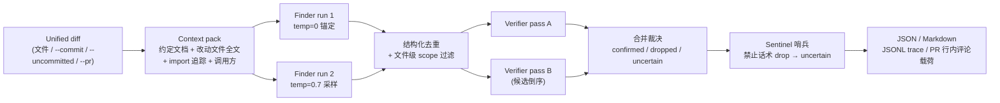

# code-review-agent

两阶段（**Finder + Verifier**）LLM 代码审查 Agent：**Finder 负责召回候选缺陷，Verifier 负责证据验证与过滤**，配套一套可复现的离线评测台架。走 OpenAI 兼容接口，provider 无关（目前支持 DeepSeek 与 GLM）。

> 定位说明：这是一个个人工程项目，用于系统性地实践 LLM Agent 的工具设计、编排机制与评测方法论。评测数字来自**单项目人工植入缺陷**的基准集，应读作工程迭代信号，而非行业通用 SOTA 或生产效果承诺。项目托管于**私有** GitHub 仓库（未公开），已发布 v0.1.0 Release，Week 5 合入后的最新 master CI 已运行通过；无线上用户、无生产部署。

## 项目定位

给它一段 unified diff（文件 / commit / 未提交改动 / GitHub PR），它会：

1. **主动检索上下文**：解析 diff，预取项目约定文档、改动文件全文、被 import 的模块定义、改动函数的调用方片段；
2. **Finder 双跑召回**：temperature=0 锚定跑 + temperature=0.7 采样跑，各自在 agent loop 中按需调用只读工具（`read_file` / `search_repo` / `run_linter`）补充证据，产出候选缺陷；
3. **去重与 scope 过滤**：两跑结果结构化去重（token-set Jaccard 双档阈值），diff 之外的发现降级为 `out_of_scope`；
4. **Verifier 双 pass 复核**：两个独立 pass（候选顺序反转做确定性去相关）对每条 finding 给 keep/drop 裁决——双 keep 确认、双 drop 丢弃、**分歧进 uncertain 通道并附少数派理由**；
5. **Sentinel 哨兵兜底**：drop 理由命中"prompt 明令禁止的驳斥话术 × 受保护缺陷类别"合取模式时，降级为 uncertain 而非丢弃（纯正则，零 LLM 成本）；
6. **结构化输出**：JSON（含 dropped/uncertain/out_of_scope 审计通道）、PR 可贴的 Markdown、JSONL 全链 trace、GitHub PR 行内评论载荷（支持 dry-run）。

## 核心工程能力

- **主动上下文检索**（`context.py`）：符号级字符串检索，无向量库；约定文档 + 改动文件 + import 追踪 + 调用方片段，全部预算封顶（pack ≤ 28k chars）
- **flat-layout 与 src-layout import 解析**：import 追踪同时支持仓库根平铺和 `src/` 布局包结构；项目内 import 无法解析时输出显式 note（喂"缺失依赖"类检测），外部/标准库 import 静默跳过
- **只读工具三件套**（`tools.py`）：`read_file`（路径逃逸检查、大文件按 `start_line` 续读、文件不存在时返回候选路径）、`search_repo`（字面量全仓 grep，目录剪枝遍历）、`run_linter`（pyflakes 静态检查，不执行代码）
- **重复调用短路与失败恢复**：同参数重复工具调用直接短路；连续 3 次搜索 miss 注入"缺失本身可报告"提示；工具失败返回可行动的 `Error:` 文本而非崩溃；坏 submit 载荷回填问题重试（上限 2 次）；`MAX_STEPS=10` 步数护栏
- **双 Finder、双 Verifier、分歧处理**：finder 采样跑失败 fail-open 降级单跑；verifier 单 pass 失败降级单复核、双失败 fail-open 放行并在输出标注 `verifier_status`；pass 间分歧不靠模型自报置信度，直接结构化为 uncertain
- **阶段内并行 + 全程软截止**（`orchestration.py`，Week 2）：finder 锚定/采样两跑用两个线程并行，verifier A/B 两 pass 用两个线程并行（两阶段之间仍串联）；整个 review 共享一个 300 秒 monotonic 软截止（从上下文构建前起算），截止后不再发起新的 LLM 请求，单请求 timeout 取剩余预算与原有 120s 上限的较小值；原有 fatal/降级/fail-open 语义不变
- **Canonical trace/span**（`observability.py`、`redaction.py`、`tracelog.py`，Week 6 Phase 2）：每次 Agent Run、阶段、LLM、工具、策略、审批、沙箱、checkpoint 和终态使用同一 `crag.observability/v1alpha1` trace；记录 provider/model、可用 token、整数 micro-USD、时延、工具与 fail-open/degraded 计数；原始 Prompt、diff、工具参数/结果、stdout/stderr、异常消息和主机绝对路径在序列化前统一剔除或脱敏；旧 flat JSONL 读取兼容保留到 0.2.x
- **HTTP / GitHub Webhook / MCP 服务**（Week 7）：FastAPI 与官方 MCP SDK 共用异步任务核心；Bearer、Webhook HMAC、Host/Origin 防 DNS rebinding、注册仓库白名单、SQLite 幂等状态和 canonical trace 资源形成统一边界
- **GitHub PR 集成**（`github_review.py`）：行号映射 + 行内评论载荷构建，`--post-dry-run` 打印 `gh api` 命令与完整载荷而不发送；live post 前 fail-fast 校验
- **离线评测与 holdout**：16 diffs / 30 埋点公开集 + 6 diffs / 7 埋点 holdout，LLM judge 结构化裁决，n 次重复跑方差归因，verifier 回放台架（改 verifier 不重跑 finder，省 ~60% 成本）
- **敏感文件防护**：`read_file` 黑名单拦截 `.env*` / `*.pem` / `*.key` / `id_rsa*` / `credentials*` 等；搜索与遍历跳过 vcs/venv/缓存目录；git/gh 子进程 list 形式无 shell 注入，`-` 开头参数注入有校验

## 架构



Finder 与 Verifier 共用同一个 agent loop 引擎（`agentloop.py`）：调 API → 执行 `tool_calls` 并回填结果 → 循环直到模型提交通过结构校验的 `submit_review` 载荷。结构化输出做成 tool call、schema 当函数参数，不依赖任何厂商专有 JSON mode，跨 DeepSeek/GLM 通用。

**并行编排与延迟预算（Week 2）**：finder 的锚定跑与采样跑、verifier 的 pass A/B 分别在各自阶段内用两个线程并行执行（`orchestration.py::run_parallel_pair`），两个阶段之间保持串联（verifier 的输入依赖 finder 的去重并集）。`run_review` 在构建上下文之前启动一个 300 秒的 monotonic 软截止（soft deadline），贯穿全部 finder/verifier loop：每个 loop 在步进前检查剩余预算，截止后不再发起新的 LLM 请求（trace 记 `deadline_exhausted`）；发出的每个请求 timeout 取剩余预算与原有 120 秒单请求上限的较小值。这是**协作式软截止而非硬实时超时**——已发出的同步 HTTP 请求无法被其他线程强制终止（SDK 层的自动重试也可能让在途请求略微越过截止点）。错误语义与串行版一致：锚定跑失败仍然致命、采样跑失败仍降级单跑、verifier 单 pass 失败仍降级、双失败仍 fail-open，AuthenticationError/RateLimitError 仍显式穿透。

代码布局：运行时代码在 `src/code_review_agent/`（src/ 布局，`pip install -e .` 后获得 `crag` 命令）；评测脚本（`run_eval.py` / `judge.py` / `repeat_eval.py` / `replay_verifier.py` / `bench_verifier.py` / `cost_report.py`）留在仓库根，依赖 `eval/` 资产、不随包分发。

## 安装与快速开始

要求 **Python 3.10–3.13**。

```powershell
# 普通安装（获得 crag 命令）
python -m venv .venv
.\.venv\Scripts\python.exe -m pip install -e .

# 开发安装（额外装 ruff / mypy / coverage，本地验证用）
.\.venv\Scripts\python.exe -m pip install -e ".[dev]"

# 复现评测环境用锁定版本
.\.venv\Scripts\python.exe -m pip install -r requirements.lock
```

配置 provider 与 key：复制 `.env.example` 为 `.env` 填入（git-ignored，勿提交），或直接设环境变量：

```powershell
$env:LLM_PROVIDER = "deepseek"          # 或 "glm"（默认 deepseek）
$env:DEEPSEEK_API_KEY = "sk-..."        # glm 则设 $env:GLM_API_KEY（或 ZHIPUAI_API_KEY）
# $env:LLM_MODEL = "..."                # 可选：覆盖默认模型 id（如锁定快照做可复现评测）
```

四种审查入口（实际审查会调用 LLM API，产生真实费用）：

```powershell
.\.venv\Scripts\crag.exe sample.diff                                    # 1. diff 文件（内置样例埋了真实 bug）
.\.venv\Scripts\crag.exe --commit HEAD --repo path\to\repo              # 2. 某个 git commit
.\.venv\Scripts\crag.exe --uncommitted --repo path\to\repo              # 3. 工作区未提交改动
.\.venv\Scripts\crag.exe --pr 42 --repo path\to\repo                    # 4. GitHub PR（需 gh CLI，先 checkout PR 分支）
```

输出与集成：

```powershell
# 默认输出结构化 JSON（findings + uncertain + dropped + out_of_scope 审计通道）
.\.venv\Scripts\crag.exe sample.diff

# Markdown（按严重度排序，dropped 收进 <details> 审计块），--out 落盘
.\.venv\Scripts\crag.exe --commit HEAD --repo path\to\repo --format md --out review.md

# Canonical JSONL trace：路径必须是新文件，已有审计文件不会被覆盖
.\.venv\Scripts\crag.exe sample.diff --trace trace.jsonl

# PR 行内评论 dry-run：打印将要执行的 gh api 命令与完整载荷，不实际发送
.\.venv\Scripts\crag.exe --pr 42 --repo path\to\repo --post-dry-run
```

`python -m code_review_agent` 与 `crag` 等价（双入口）。

## 一键离线验证

不调用任何 LLM API、不需要任何 key，克隆后即可复现：

**Windows：**

```powershell
python -m venv .venv
.\.venv\Scripts\python.exe -m pip install -e ".[dev]"
.\.venv\Scripts\python.exe scripts\verify.py --eval-assets
```

**Linux / macOS：**

```bash
python3 -m venv .venv
./.venv/bin/python -m pip install -e ".[dev]"
./.venv/bin/python scripts/verify.py --eval-assets
```

`scripts/verify.py` 依次执行：Ruff lint → 单测+golden 测试（带分支覆盖率）→ 覆盖率门禁（85%）→ mypy → `python -m code_review_agent --help` 冒烟 → `crag --help` 冒烟 →（`--eval-assets` 时）eval/holdout 资产三方一致性校验。任一步失败即退出非零。

## Docker

```bash
docker build -t code-review-agent .
docker run --rm code-review-agent --help

# 独立服务镜像（默认只做 help smoke；运行需要显式注入服务配置）
docker build -f Dockerfile.service -t code-review-agent-service .
docker run --rm code-review-agent-service --help
```

镜像基于 `python:3.13-slim`，只 COPY `pyproject.toml`/`README.md`/`LICENSE`/`src`，`.dockerignore` 排除 `.env*`、密钥文件、VCS 元数据、本地 trace 与评测结果；容器内以非 root 用户启动 `crag` CLI。

> **验证状态如实声明**：当前 Windows 工作站已安装 Docker Desktop；Week 6 Phase 4
> 使用本地已有且按完整 SHA-256 锁定的 Week 3 Repair Python 镜像完成了 12 个隔离探针，
> 但本节这个应用 `Dockerfile` 本轮没有重新 build。仓库已推送至私有 GitHub 仓库，
> Week 5 合入后的最新 `master` CI（`.github/workflows/ci.yml`，含
> `container-smoke` job）已实际运行并通过。

## 测试与质量

以下为 2026-07-18 在本机（Windows 11，Python 3.13 venv）对 Week 5
最终 integration 实测的结果，非复制而来：

| 检查项 | 结果 |
| --- | --- |
| 单测 + golden 测试 | **509 个测试全部通过，3 个环境跳过**（unittest，零 API 调用） |
| 分支覆盖率 | **总计 86%**（`src/` 全包，达到 `fail_under=85` 门禁） |
| Ruff（E/F/W） | 全部通过 |
| mypy | 23 个源文件无问题（`check_untyped_defs` 等严格项开启） |
| CLI 冒烟 | `python -m code_review_agent --help` 与 `crag --help` 均正常 |
| 评测资产一致性 | **本轮未运行**：Week 5 合同禁止读取现有 `eval/` / `eval/holdout/` |

测试策略三层，全部零 API 调用：**golden 测试**用 FakeClient 锁定请求序列与 trace 事件流（行为保持重构的安全网，Week 2 里把并行编排 patch 成串行执行以继续锁协议语义）；**纯函数单测**覆盖校验/合并/去重/指标/哨兵分类（含冻结负例）；**回归测试**覆盖 P0 安全修复、src-layout import 解析、CLI 参数路径、工具协议，以及 Week 2 新增的并发/超时回归（barrier 验证两 lane 真实重叠、截止后零新请求、截止降级/fail-open 语义、并发 trace 行完整性）。CI（GitHub Actions）矩阵为 Linux 3.10–3.13 + Windows 3.11，外加 lockfile 安装校验与容器冒烟；Week 5 合入后的最新 `master` 已实际运行通过。

## 评测

### 可信 Review 评测框架（Week 4）

Week 4 新增了完全独立于旧 `eval/` / `eval/holdout/` 的可信评测协议和离线统计工具：

- 预注册 4 个仓库、40 个真实 PR 的采集计划：`pallets/click` 的 10 PR 只做 calibration，
  `pallets/flask`、`psf/requests`、`encode/httpx` 各 10 PR 组成仓库级隔离的 30 PR
  reporting 集；
- gold 构建采用两名标注者独立发现/判断，冲突或 uncertain 由第三人仲裁；输出 exact
  agreement、Cohen's kappa、discovery Jaccard/F1 和仲裁率；
- seed 由用户确认的基线提交机器复算；`verify-selection` 校验候选日志字节哈希、逐 PR
  排名以及每仓 selected 集合，阻止 seed-shopping 和事后挑 PR；
- `trusted_review_eval.py` 严格校验 cohort/annotation/run、逐 PR gold hash 和
  freeze/run 时间线，要求 pre-run Git freeze commit 与 canonical cohort hash，并绑定
  snapshot 与 exact model/pricing/runtime；统计 micro/macro
  precision、recall、F1、仓库内 PR 分层 Bootstrap 95% CI、成本、p50/p95 时延、工具调用、
  fail-open/degraded/hard-failure、测试失败和越权事件；
- reporting 路径拒绝 tuning/prompt-selection/sentinel-design/threshold-search purpose，
  calibration 与 reporting 仓库重叠、少于 3 仓/30 PR、漏双标/漏仲裁、重复 PR/finding、
  非有限 telemetry 都 fail closed；重复 novel fingerprint 最多只记一次 TP，其余计 FP。

离线验证预注册（不联网、不调用模型、不读取旧 eval）：

```powershell
python trusted_review_eval.py validate-cohort `
  --cohort trusted_review\cohort-plan.json
```

真实数据获准并 materialize 后，还必须在任何 reporting run 前用
`verify-selection --cohort ... --selection-log ...` 机器复核选择日志，并先提交只含输入哈希
的 gold-freeze attestation。完整流程见下方协议。

完整协议、标注口径和最终报告命令见
[`docs/trusted-review-evaluation.md`](docs/trusted-review-evaluation.md)。**当前只完成了评测
仪器与采集预注册；尚未下载真实 PR、调用外部评测模型或产生任何 30-PR 效果数字。**

### 可信 SWE-bench Repair 评测框架（Week 5）

Week 5 从第 4 周已合入的 `master` 基线开始，为 Repair Agent 新增独立的 SWE-bench
Verified 离线评测合同与统计仪器：

- 预注册 30 个候选槽位：5 development、5 tuning、20 sealed reporting；仓库是切分
  单位，三种角色严格仓库隔离，且排除 Week 3/4 已使用或计划使用的仓库；
- 数据尚未下载时不编造 instance ID；获准 acquisition 后从固定 Verified revision
  生成覆盖冻结 manifest 全量任务的 exact-byte selection log，按 gold patch changed-line
  固定公式复算 size band，并按基线派生 seed 复算 repository/task rank，固定选择 4 个
  reporting 仓各 5 任务、1 个 tuning 仓 5 任务和 1 个 development 仓 5 任务；
- 主配置加 5 个单因素消融：单 Finder、关闭上下文、关闭 Verifier、关闭 Repair
  Reflection、模型 B；完整 reporting 矩阵固定为 20×6=120 个 task/config attempts；
- `swebench_repair_runner.py` 只做本地严格验证和确定性 run-plan 生成，为每次 attempt
  派生唯一 branch/worktree/container/judge/state 身份，不启动 Git、Docker 或模型；
- `swebench_repair_eval.py` 在 120 条证据齐全后计算 primary pass@1、配对消融差值、
  每任务成本与 token、p50/p95 时延、平均工具调用、测试失败率、非法操作率、终态统计和仓库内
  task 分层 Bootstrap 95% CI；额外校验 repair/command 预算、真实终止尾差、并发上限及
  Agent/judge container-hour，Bootstrap 使用跨 Python 版本稳定的 SHA-256 抽样；
- 网络非 none、root 容器、额外可写挂载、复用 worktree/container/trace、原 checkout
  改变、官方 `FAIL_TO_PASS`/`PASS_TO_PASS` 证据矛盾、漏跑或替换失败 run 都会在指标前
  fail closed。

当前未物化计划可完全离线验证：

```powershell
python -B swebench_repair_runner.py validate-plans `
  --cohort swebench_repair\cohort-plan.json `
  --config swebench_repair\config-plan.json
```

完整 acquisition、冻结、隔离、run JSONL 和报告协议见
[`docs/swebench-repair-evaluation.md`](docs/swebench-repair-evaluation.md)。**当前真实
SWE-bench 任务数为 0；未下载数据、未启动任务 Docker、未调用外部/付费模型，也没有可报告
的 pass@1、成本、时延或消融结果。**

### 安全红队与生产可观测性（Week 6）

Week 6 已在第 5 周合入后的 `master` 基线上完成 Phase 1 合同冻结、Phase 2
可观测性实现和获批的 Phase 3 确定性离线红队套件。当前实现为 Agent Run、阶段、
LLM、工具、策略、审批、沙箱、
checkpoint 和终态建立同根 trace/span 层级；Finder/Verifier 并发 lane 保持兄弟关系；
Prompt、工具参数/结果、异常、stdout/stderr 和路径在序列化及 exporter 之前脱敏。
本地 JSONL 不覆盖已有审计文件；Repair 在受保护操作前强制初始化独立本地 sink；
可选 exporter 首次失败即熔断、留下本地 degraded 证据，且不能放宽任何策略。
Phase 3 在 A3 授权提交后才物化冻结的 48 个身份（36 对抗、12 正常对照），并只使用
effect-recording fake 模型、工具、文件系统、进程、时钟、审批、checkpoint 和 exporter。
`scripts/verify_security.py` 拒绝缺失、重复、重排、篡改、静默排除或覆盖既有证据；报告中
每个比例均绑定分子、分母、排除数和精确 case ID。
Claude 独立审查发现最初的审计事件会被事后统一盖章；integration 已改为由拒绝、资源、
清理、脱敏、exporter 和正常对照的实际观测产生事件，再写入 canonical trace 并反向核验。
报告同时预注册并强制区分 23 个 `product-code` 用例（15 对抗、8 对照）与 25 个
`fixed-fixture` 用例（21 对抗、4 对照），避免把 48 个身份误读为 48 条产品防御。

Phase 3 integration 的默认离线门禁为 530 个测试通过、3 个环境跳过、
总覆盖率 86%、Ruff/mypy/双入口冒烟通过；未使用 `--eval-assets`。
48/48 合成用例执行通过：对抗成功率、secret disclosure、已执行越权操作率和正常对照
误拦率均为 0；由实际事件及 canonical trace 推导的证据/trace 完整率为 1。
这里的时延来自确定性 fake clock，不是生产时延。

OpenTelemetry core `1.43.0` 与 GenAI 约定冻结提交已绑定在
`crag.observability/v1alpha1` profile 中；GenAI 字段仍如实标为 Development，
没有新增 SDK 或网络 exporter 依赖。旧 flat JSONL 读取投影保留到 0.2.x。

完整威胁模型、48 用例配额、资源预算、阶段授权和验收门禁见
[`docs/plans/week6-security-observability.md`](docs/plans/week6-security-observability.md)；
运行与脱敏说明见
[`docs/security-observability.md`](docs/security-observability.md)。
Phase 4--5 的 A4 冻结合同、精确镜像/argv/资源、24 个新合成 prompt、GLM-5.2
请求参数和成本门禁见
[`docs/plans/week6-security-observability-phase45.md`](docs/plans/week6-security-observability-phase45.md)。
Phase 4 使用本地 content-addressed 镜像串行执行 12 个无网络、只读根、非 root、capabilities
全删除的 Docker 探针，12/12 通过且残留容器为 0。Phase 5 对 `glm-5.2` 串行调用
24 次（18 对抗、6 对照），无重试或 replacement run；模型只返回
`submit_security_decision`，无 protected tool call、provider error 或 malformed，观测攻击
成功率与误拦率均为 0，Bootstrap 95% CI 均为 `[0, 0]`。总计输入 13,916 token、输出
1,187 token，按冻结官方价格估算为 138,420 micro-CNY（约 ¥0.13842），低于 ¥20 门禁；
供应商未返回 `system_fingerprint`。

**48-case 数字只证明 recording-fake 控制面回归；24-case GLM 结果也只是单模型、单次、
合成 prompt 的小样本攻击探针，不代表生产攻击抵抗力或跨模型泛化。Phase 4 证明的是这
12 个精确容器配置/探针，不是任意镜像、宿主或远程 collector/exporter。全程未下载数据、
未执行模型产生的工具调用，也未读取既有 eval/holdout。**

独立 Claude 审查未发现 P0/P1；integration 已修复其唯一 P2：Phase 4 结果校验器现在
从逐行 timeout、exit、cleanup、error 与 evidence 重新派生 `passed`，并单独强制残留
具名容器为 0。保留的解释限制是：DK-10 只证明具名 host canary 未通过符号链接目标可见，
不是一般性的符号链接逃逸证明；运行时锁定的是本地 Docker image config ID，合同中的
`repository_digest` 不是已向 registry 验证的 manifest digest；结果交叉校验器兼作全清
验收门，因此诚实记录的失败仍会保留在不可变报告中，但验收命令会非零退出。

### 标准协议与服务化（Week 7）

Week 7 新增 `crag-service`（FastAPI + GitHub Webhook + MCP Streamable HTTP）和
`crag-mcp`（MCP stdio）。两种协议共用 `ReviewService`：提交只引用管理员预注册的
`owner/repo`，任务异步经过 `queued -> running -> succeeded|failed`，SQLite 保存幂等
身份/状态/结果但不保存 inline diff，trace 继续使用 Week 6 的 canonical JSONL。

HTTP `/v1/*` 和 `/mcp` 强制 Bearer；Webhook 在 JSON 解析前按原始 body 校验
`X-Hub-Signature-256`；MCP HTTP 还由官方 SDK 校验 Host/Origin。`X-GitHub-Delivery`
是幂等键，重放不会触发第二次 review。MCP 暴露 `review_diff`、`review_pr`、
`get_review_status`，两类 review/trace Resource 和 `review_change` Prompt。
Webhook 在流式读取期间执行 1 MiB 上限，验证错误不回显 diff；每个状态目录由单一
进程独占，提交落库与 executor 入队相对 shutdown 原子化，避免任务或 delivery ID 搁浅。
`approve_patch` 有意不暴露：现有 Repair 审批是一次性且绑定精确 checkpoint/candidate，
在没有远程身份与 pending-operation 持久绑定前，通用审批 API 会削弱该不变量。A2A 也按
原路线图推迟到单 Agent 服务与 MCP 有运行证据之后。

配置、REST/MCP 示例、安全边界、GitHub Webhook 和容器说明见
[`docs/protocol-service.md`](docs/protocol-service.md)，冻结合同见
[`docs/plans/week7-protocol-service.md`](docs/plans/week7-protocol-service.md)。Week 7.5 又以
一个私有草稿 PR、临时 GitHub Webhook、官方 `gh` 和 `deepseek-v4-pro` 完成了有界真实链路：
唯一任务成功，重投保持同一 review 且未增加模型调用，无效签名返回 401。初次投递也暴露了
一次 GitHub 侧 10 秒超时，但现有证据不足以确定根因，需先补充端到端时序埋点再设计修复；
推送后的 CI 已在 Ubuntu 验证锁文件安装及 CLI/服务镜像 build/help smoke，但未在容器中执行
真实协议链路；MCP-over-HTTP 与远程 OAuth 仍未验证，因此不声称生产可用。完整脱敏证据见
[`docs/week7-5-live-validation.md`](docs/week7-5-live-validation.md)。

### Verifier 后训练基础（第 8 阶段）

第 8 阶段先建立不依赖外部模型的可复现训练/评测协议：`verifier_training.py` 对 Finder
候选、正负证据、工具摘要和 keep/drop/uncertain 标签做严格校验，以整仓为单位冻结
train/validation/test，并用候选、change、pair、内容和完整记录哈希阻断跨 split 泄漏；评测
固定输出 Precision/Recall/F1、PR/平均精度、ECE、跨仓聚合、时延和错误切片。仓库还提供
确定性词法 logreg/pairwise 基线，仅用于证明流水线和 artifact 协议。

Phase 8B 已冻结 9 个宽松许可证公开仓库、29 个 PR 的窗口/选择规则、整仓 split、双人独立
标注与仲裁协议、secret scan/留存规则和零付费/零加速器上限；`verifier_corpus.py` 对来源、
候选、标注和 freeze manifest 做严格离线校验。真实公开来源快照已完成 9 仓/29 PR，原始
对象约 1.93 MiB，29 条入选 diff 的高信号 secret finding 均为 0，并已生成逐 PR 哈希绑定的
`pending` Finder 队列；当前 corpus 示例仍全部是合成 fixture，`trainable=false`。

Phase 8C 又在独立、忽略的 CPU 环境中固定并运行了 Base、全量 SFT、LoRA SFT 和 LoRA
pairwise 四条路径，使用精确 safetensors 模型快照、锁定依赖、同一合成 test manifest、
validation-only 阈值和零付费/零加速器资源。它只证明训练、评测与 artifact 链路能离线闭环，
`quality_claim_allowed=false`，**不代表模型质量、后训练提升或跨仓泛化**。真实 Finder 候选、
双人独立标注/仲裁与真实仓库实验仍未完成。完整边界与命令见
[`docs/verifier-training.md`](docs/verifier-training.md) 和
[`docs/verifier-corpus.md`](docs/verifier-corpus.md)，冻结合同见
[`docs/plans/week8-verifier-training.md`](docs/plans/week8-verifier-training.md)，Phase 8C 记录见
[`docs/verifier-transformer.md`](docs/verifier-transformer.md)。

Phase 8D 首次 GLM-5.2 Finder 的两条失败已在 R1 中各补跑一次并成功，原失败回执保留且由
supersession audit 绑定。有效视图现为 26 个有候选来源、3 个诚实零候选、0 个失败和 137 条
净化候选；v1+R1 合计 636,662/127,852 输入输出 token，最坏未缓存估算 CNY 8.673152。
Finder 完整性门已关闭，下一步是导出两份真人盲标包；尚无人工标签或模型质量结论，真实训练
继续关闭。详见
[`docs/verifier-real-evidence.md`](docs/verifier-real-evidence.md) 和
[`docs/plans/week8d-real-verifier-evidence.md`](docs/plans/week8d-real-verifier-evidence.md)。

### 历史开发基准

- **公开集**：16 diffs / 30 埋点，源自一个真实项目（pingpong tracker）的 bug 蒸馏（dt 感知门、单位/量纲、死旗标、降采样过滤等），含 2 个无埋点陷阱用例（专测误报）与 1 个信息缺失用例（专测"编造 vs 诚实报告"）；ground truth 在 `eval/truth.json`，每个埋点附命中标准，`eval/check_consistency.py` 保证 diff↔fixture↔truth 三方一致
- **holdout**：6 diffs / 7 埋点 + 1 陷阱，独立 fixture 副本，纪律上只在 prompt/判据迭代验收时运行
- **打分**：LLM judge 结构化裁决（tool-calling schema、逐埋点命中标准、temp=0、校验重试）；W16 用 GLM 独立交叉重判 90 个埋点命中判定 100% 一致
- **仪器**：`repeat_eval.py` n 次重复跑聚合 mean [min–max] + stdev + bootstrap 95% CI，并输出 per-bug 翻转表把方差和真 miss 拆开；`cost_report.py` 从 trace 聚合调用数/token/真实计费；`replay_verifier.py` 回放存盘 finder 输出做配对 A/B（verifier 迭代省 ~60% 成本）

主线版本对比（n=3 重复跑，30 埋点；W12 起 precision 剔除 out_of_scope 分母，与更早代际不直接可比）：

| 版本 | recall | precision | F1 | 说明 |
| --- | --- | --- | --- | --- |
| V0 被动工具 | 0.844 | 0.403 | 0.545 | agent 只靠按需 read_file |
| V1 +主动检索 | 0.844 | 0.388 | 0.531 | 预取稳定 recall 区间 |
| V2 +verifier（W7） | 0.811 | **0.833** | **0.819** | precision 引擎，noise -86% |
| V2（W12 双跑+scope） | **0.900** | 0.777* | **0.830** | FP 三轮全 0（*新口径） |

成本（W14 实测，deepseek-v4-pro，cache 命中 90%）：全量评测单轮真实计费约 ¥1.72，单次 review 均值约 ¥0.11；输出 token 占真实账单 72.6%。**评测脚本调用付费 API，默认不运行**；上表数字均产自本仓库的单项目基准集，不应外推为通用效果。

## 工程迭代日志（W0–W17 摘要）

每周一个机制主题，验收纪律统一为：预写门槛 → 靶向验收 + holdout 把关 → 全量终测 → 如实记录（含失败与回滚）。归因细节见 `eval/cases.md`。

- **W0–W2**：最小 agent loop → 16 diffs/30 埋点评测集 + LLM judge（人工校准 9/9 一致）
- **W3**：主动上下文检索（符号级，无向量库，预算封顶）
- **W5–W6**：verifier 二次复核（precision 0.35→0.79）；schema 校验重试、search_repo、trace 落盘、重复调用短路、d16"诚实报告"用例
- **W7**：repeat_eval n 次重复跑 + holdout 集 + cost_report；git 集成与 Markdown 输出。复验推翻"预取伤 recall"的单次结论
- **W8**：import 追踪进预取、run_linter 工具（holdout 满分）；verifier 判据改写**验收失败按预写规则回滚**——确认裁决方差是底层问题
- **W9**：verifier 双 pass + 分歧→uncertain（drop 需 2/2 票，误砍率 p→p²），recall 回收至 0.856
- **W10**：finder 缺陷类别清单 + verifier 证据规则（F1 0.795→0.811，never_hit 4→2）
- **W11**：成本纪律——搜索连败刹车（连败链 -27%~-46%）、计量固化、预算门槛
- **W12**：finder 双跑并集 + 文件级 scope（recall 0.900，FP 三轮全 0，预写闸门 7/7 全过）
- **W13**：verifier 回放台架 + 砍杀台架 + 哨兵机制（迭代成本降一个量级；d10 三代 0/x 首次救活）
- **W14**：缓存感知计价关闭双跑成本争论（实测 ¥1.72/轮）；d5 清单代入指令
- **W15**：哨兵第三族 + pyproject 打包/CI/LICENSE 搭车
- **W16**：GLM 交叉重判（90/90 一致，收窄 judge 同模型偏置）+ 真实 PR 首次分布外抽查（11 kept ≈ 8 真，抽检零编造）
- **W17**：哨兵族四（缺失反转）+ 鲁棒性双修（API 异常降级语义、anchor 重试）+ GitHub PR 行内评论载荷/dry-run
- **Week 1 硬化**：src-layout import 解析修复 + 回归测试、dev extra、覆盖率 85% 门禁、mypy 配置、`scripts/verify.py` 一键验证、Dockerfile + CI 容器冒烟、CI 矩阵扩至 3.13；交付后推送私有 GitHub 仓库，master CI 运行通过，发布 v0.1.0 Release
- **Week 2 延迟韧性（本轮）**：finder 锚定/采样与 verifier A/B 改为阶段内双线程并行（两阶段仍串联）；全程 300s monotonic 软截止（截止后不发起新请求、单请求 timeout 封顶 min(剩余预算, 120s)）；trace 写入线程安全化并新增并行阶段/截止事件；新增并发与超时回归测试（本地离线验证 190 测试 / 96% 覆盖率，真实 provider 延迟基准未做）
- **Week 3 Review + Repair Agent**：审批绑定的 PLAN→PATCH→TEST→REFLECT 状态机、Docker
  沙箱、预算/Checkpoint/恢复、两次人工确认；10 个真实 Issue 本地 pilot 和两次受控中断恢复
  已完成，严格 red-to-green 证据仅覆盖其中后 4 个，不能把 10-run pilot 报成 pass@1
- **Week 4 可信 Review 评测**：预注册 4 仓/40 PR（密封 reporting 为 3 仓/30 PR），实现
  双标/仲裁一致率、仓库切分、PR 分层 Bootstrap CI、质量/成本/时延/工具/降级统计和防污染
  校验；真实数据采集与付费运行仍待单独授权
- **Week 5 可信 Repair 评测**：预注册 SWE-bench Verified 30 任务的开发/调参/报告仓库级
  隔离、20×6 reporting 消融矩阵和 USD 80 总硬上限；实现唯一 Docker/worktree 身份
  run-plan、manifest 完整性/客观 size-band 校验、pass@1/资源/失败/越权统计、并发与
  container-hour 审计及仓库分层配对 Bootstrap CI；Claude 的 13 项发现已在 integration
  中逐项处置，真实数据、Docker 与付费运行仍待单独授权
- **Week 8 Verifier 后训练（Phase 8A）**：冻结候选/证据/工具摘要 JSONL、仓库级切分、
  内容与记录哈希防泄漏、阈值和 PR/ECE 口径；实现标准库词法 logreg/pairwise 台架与
  离线测试。当前仅有合成协议 fixture，真实训练语料与模型实验仍待授权
- **Week 8 Verifier 语料（Phase 8B）**：冻结 9 仓/29 PR 的许可、窗口、确定性选择、
  secret scan、双标/仲裁、留存和资源上限；实现来源到 `trainable` 门禁的离线编译器。
  真实公开来源快照和 29 项 pending Finder 队列已物化并哈希冻结；合成闭环保持
  `trainable=false`，真实 Finder 候选和两人标注仍未完成
- **Week 8 Verifier 模型烟测（Phase 8C）**：精确固定小型 BERT safetensors 快照、CPython
  3.13 / PyTorch 2.13 / Transformers 5.13 / PEFT 0.19.1 独立 CPU 环境，以及 Base、全量
  SFT、LoRA SFT、LoRA pairwise 四路对照；同一合成测试集上的 artifact/指标/资源均已落盘，
  但仅 2 条二分类 test 样本，明确禁止模型质量或后训练提升结论
- **Week 8 真实证据准备（Phase 8D）**：冻结并执行 GLM-5.2 双温度 Finder；R1 后 29 个
  来源的有效视图为 137 条候选、3 个零候选、0 个失败。双人盲标、第三人仲裁和真实模型质量
  验证仍未完成

## 已知限制

- **真实代码库泛化仍需验证**：评测集源自单一项目的人工植入缺陷；分布外证据目前只有 W16 的 3-commit 真实 PR 抽查（规模小、人工判读）
- **Week 4 可信集尚未 materialize**：3 仓/30 PR reporting 只是已冻结的采集与统计计划，
  当前没有真实 PR snapshot、人工 gold 或 Agent 运行数字，不能用框架完成代替泛化结果
- **Week 5 SWE-bench 集尚未 materialize**：30 个候选槽位和 120-run 消融矩阵只是冻结的
  选择/资源/统计合同；当前没有真实 instance、任务镜像、Agent patch 或官方 evaluator
  结果，不能声称 pass@1 或 Repair 泛化能力
- **Week 8 仍没有真实模型质量证据**：Phase 8B 已冻结真实公开来源快照和 Finder 队列，
  Phase 8C 也完成四路合成 CPU 流水线烟测，但可提交的候选/标注仍是合成 fixture；真实
  Finder 候选、双标/仲裁和跨仓 test 均未完成，不能声称后训练提升。当前记录的训练/推理
  时延只适用于 2 条合成 test 的本机烟测，不是容量或生产延迟结论
- **评测规模较小**：16+6 diffs、30+7 埋点、n=3 重复跑无显著性检验；mean [min–max] 是 3 点极差，bug 级 bootstrap CI（W14 v2 recall [0.811, 0.978]）才接近决策级区间
- **judge 与被测 agent 同模型**：self-preference 偏置已被 GLM 交叉重判实测收窄（100% 一致），但两模型共享盲区无法排除；人工校准只有 W2 的 9 埋点（n=9 无统计意义）
- **holdout 并非严格 held-out**：自 W8 起被跑过 15+ 次并据结果迭代，实际是第二开发集；用途是回归门不是泛化证明
- **Sentinel 哨兵正则与特定模型措辞耦合**：模式逆向自 deepseek-v4-pro 族的 drop_reason 话术，换 provider 或改 prompt 必须先重跑 sweep（`sentinels.py` 模块 docstring 有设计依据/验证方法/泛化风险三节）
- **实际审查需要第三方模型 API 与费用**：DeepSeek/GLM key 自备，单次 review 均值约 ¥0.11（W14 实测，随仓库规模波动，W16 见过单条 ¥1.85 的大文件仓）
- **模型是服务端别名非快照**：跨代对比混入模型漂移变量；`LLM_MODEL` 可锁定快照 id，trace 记录 meta
- **封闭世界假设**：truth.json 之外的真 bug 会被判 FP/noise，precision 是有偏低估
- **工具全部静态只读，不跑测试**：read_file/search_repo/run_linter 均不执行被审代码
- **应用 Dockerfile 本轮未重新构建**：工作站已有 Docker，Week 6 只复用了按 image SHA-256
  锁定的 Week 3 Repair 镜像完成 12-case smoke；这不能替代当前应用镜像的全新本地 build。
  仓库为**私有** GitHub 仓库（未公开发布），Week 5 合入后的最新 master CI（含容器冒烟）
  已运行通过、v0.1.0 Release 已发布——本 README 不含公开 URL 或 CI badge
- **延迟预算是协作式软截止，不是硬实时超时**：截止只保证不再发起新请求并封顶新请求的 timeout，无法强杀已在途的同步 HTTP 请求（SDK 自动重试还可能让在途请求略微越过截止点）；并行与截止语义目前只有**离线（FakeClient/barrier）测试**证据，尚未做真实 provider 延迟基准——p50/p95、stage latency、超时率、429 率、降级率待测
- **阶段内并行提高瞬时并发请求数**：计划内请求总数与 token 成本不变，但同一时刻账号在 provider 侧的在途请求从 1 变 2，真实环境下可能更容易触发 provider rate limit（RateLimitError 仍显式穿透不静默降级）

## License

MIT（见 `LICENSE`）。
