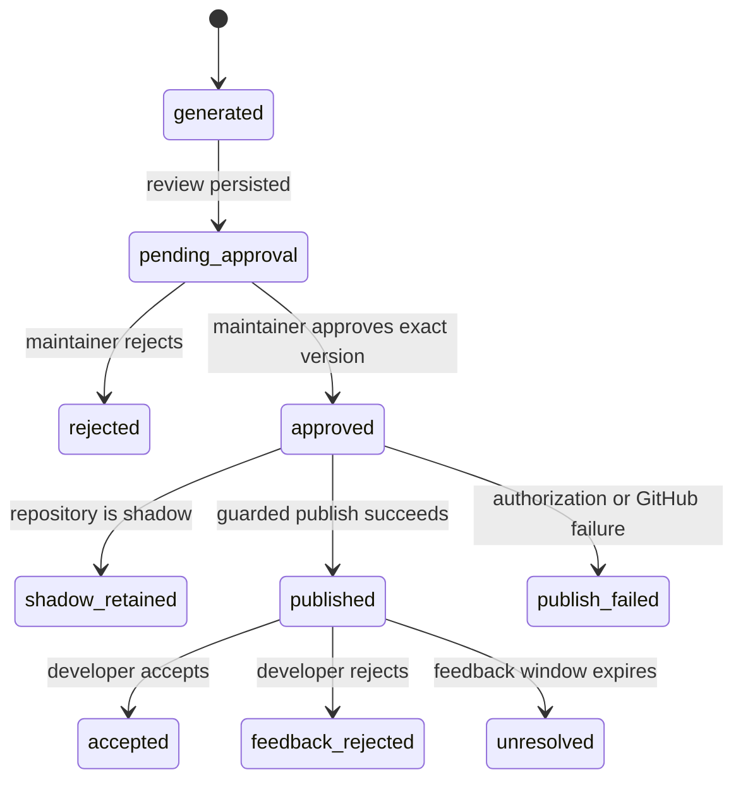

# 生产架构收敛

## 文档性质

本文描述 Review 产品主线的**目标架构合同**，不是“已经生产部署”的声明。图中绿色节点已有
实现或有界 fake/Postgres 验证，黄色虚线节点是进入生产闭环前必须补齐的能力。Phase 9C 已实现
API/worker 分离、Postgres lease、背压和同主机容器编排基础；云部署、真实身份验证、完整审批发布、
跨主机 artifact store 和生产 SLO 仍不在已完成范围。

## 目标链路

```mermaid
flowchart LR
    subgraph GH["GitHub"]
        PR["PR / synchronize event"]
        COMMENTS["Review comments"]
        DEV["Developer accept / reject"]
    end

    subgraph CONTROL["Control plane"]
        ADMIN["Organization admin<br/>repo registry · mode · budgets"]
        API["Webhook / API<br/>HMAC · auth · quota · durable ack"]
        IDEM["Postgres job database<br/>idempotency · state · usage"]
        QUEUE["Lease queue<br/>SKIP LOCKED · heartbeat · fencing"]
        HEALTH["Liveness / readiness<br/>schema · DB · worker heartbeat"]
        APPROVAL["Maintainer approval<br/>RBAC · bound nonce · payload hash"]
        PUBLISH["GitHub publisher<br/>revalidate · fail closed"]
        FEEDBACK["Feedback service<br/>finding-version binding"]
    end

    subgraph REVIEW["Review data plane"]
        WORKER["Review worker"]
        ARTIFACT["Private artifact volume<br/>payload · per-attempt trace"]
        CONTEXT["Context builder<br/>registered checkout · repo rules"]
        ENGINE["Finder → dedupe/scope → Verifier"]
        FINDINGS["Finding store<br/>evidence · status · content hash"]
        RULES["Repository rules / feedback memory<br/>versioned · aggregate · reversible"]
    end

    subgraph OBS["Measurement and audit"]
        TRACE["Canonical trace / audit<br/>redacted spans · stable errors"]
        METRICS["Metrics aggregator<br/>quality · time · reliability · cost"]
        DASH["Repository / organization dashboard"]
    end

    PR -->|"signed webhook"| API
    ADMIN -.->|"configure"| API
    ADMIN -.->|"register / shadow by default"| IDEM
    API -->|"persist before 2xx"| IDEM
    API -->|"fsync + opaque key"| ARTIFACT
    IDEM --> QUEUE
    QUEUE --> WORKER
    WORKER -->|"lease heartbeat / fenced result"| IDEM
    WORKER --> ARTIFACT
    WORKER --> CONTEXT
    RULES -.->|"approved repo context"| CONTEXT
    CONTEXT --> ENGINE
    ENGINE --> FINDINGS
    FINDINGS -.->|"pending findings"| APPROVAL
    APPROVAL -.->|"approved exact version"| PUBLISH
    APPROVAL -.->|"rejected"| FINDINGS
    PUBLISH -.->|"review API"| COMMENTS
    COMMENTS -.-> DEV
    DEV -.->|"version-bound feedback"| FEEDBACK
    FEEDBACK -.-> FINDINGS

    API --> TRACE
    WORKER --> TRACE
    ENGINE --> TRACE
    APPROVAL -.-> TRACE
    PUBLISH -.-> TRACE
    FEEDBACK -.-> TRACE
    IDEM --> METRICS
    FINDINGS -.-> METRICS
    TRACE --> METRICS
    METRICS -.-> DASH
    METRICS -.->|"eligible aggregate"| RULES
    APPROVAL -.->|"approve rule version"| RULES
    API --> HEALTH
    WORKER --> HEALTH

    classDef current fill:#d9ead3,stroke:#38761d,color:#1d1d1d;
    classDef target fill:#fff2cc,stroke:#bf9000,stroke-dasharray:5 5,color:#1d1d1d;
    class PR,API,IDEM,QUEUE,HEALTH,WORKER,ARTIFACT,CONTEXT,ENGINE,FINDINGS,TRACE current;
    class COMMENTS,DEV,ADMIN,APPROVAL,PUBLISH,FEEDBACK,RULES,METRICS,DASH target;
```



“已有”表示仓库中存在相应能力或有界验证，不表示生产完备。Phase 9C API 不执行 Review；多个
worker 通过 Postgres lease 协调，inline payload/trace 仍依赖单 Docker host 的私有共享 volume。
任务成功只到 `awaiting_approval`。当前 CLI 有 GitHub publish 能力且 Week 7.5 有单次 webhook
链路证据，但服务端没有 Phase 9D 的完整审批/发布绑定，所以 publisher 仍整体标为目标能力。

## 当前实现与目标差距

| 层 | 当前可核验事实 | 生产主线要求 | Phase 9C 状态 |
| --- | --- | --- | --- |
| GitHub 接入 | FastAPI webhook；HMAC；仓库注册；delivery + PR/head/policy 幂等 | GitHub App/OAuth、可运营 hook、端到端 SLO | durable ack 已实现；真实 GitHub 未授权 |
| 异步执行 | API/worker 分离；Postgres `SKIP LOCKED`；lease/heartbeat/fencing；有限 retry | 故障演练、容量模型、多区域策略 | 同主机 fake/Postgres 验证，不声称 exactly-once |
| 数据库 | 组织级 Phase 9B schema + Phase 9C job/quota/worker/attempt 字段 | 备份、在线迁移、failover、数据保留 | 显式 Alembic migration；生产多 worker 只支持 Postgres |
| Artifact | DB opaque key + 私有共享 payload/trace volume | 跨主机对象存储、加密/备份、清理 SLO | 单 Docker host 基础，非高可用存储 |
| Review 引擎 | Python diff 上下文、双 Finder、去重/scope、双 Verifier、sentinel | 冻结版本、shadow 运行、仓库策略、SLO 与成本门禁 | 算法未改；调用次数有硬预算 |
| 审批 | Finding decision/RBAC 基础；job 停在 `awaiting_approval` | 绑定 repo/PR/head/Finding hash 的完整一次性批准 | Phase 9D 实现 job transition |
| 发布 | CLI 可构建/发送 GitHub review；服务不自动发布 | shadow 默认；guarded publish 逐次重验权限和 payload | 禁止外部写入 |
| 反馈/记忆 | 版本绑定 feedback 基础；无生产聚合记忆 | 发布后反馈、仓库级版本化规则、可回滚 | 不进入 Phase 9C 执行路径 |
| 可观测 | redacted canonical JSONL、稳定错误、worker heartbeat、usage | 跨服务 exporter、告警、完整成本和数据质量 | 本地 artifact + DB lineage；无生产 exporter |
| 部署 | 非 root 单镜像；Postgres/migrate/API/scale-worker Compose；健康检查 | TLS、secret manager、镜像签名、备份、云编排 | fake-run 基础，不是云部署 |

## 核心领域对象

### Repository policy

```text
repository_id
mode = shadow | guarded_publish
registered_checkout / installation identity
allowed_events
review_policy_version
active_rule_version
cost_budget
latency_slo
```

仓库创建时 `mode=shadow`。切换到 `guarded_publish` 是组织管理员的显式配置变更，必须审计；
切换不追溯发布 shadow 阶段的 Finding。

### Logical Review

```text
unique(repository_id, pull_request_id, head_sha, review_policy_version)
review_id
delivery_ids[]
submission_key / idempotency_key_hashes[]
state = received | queued | leased | running | awaiting_approval | ...
attempts[]
lease_owner / lease_token / lease_expires_at / heartbeat_at
attempt_count / retry_category / available_at
result_sha256
final_trace_key
```

delivery 可以多对一映射到 Review。基础设施 retry 只增加 attempt，不增加逻辑 Review；这同时是
completion、cost 和 duplicate webhook 指标的分母边界。每次 attempt 都是 at-least-once；fencing
保证旧 lease 不能写入可见结果，但不保证已经发出的 provider 请求 exactly-once。

### Finding

```text
finding_id
review_id
fingerprint
content_sha256
path / line / severity / category
evidence references
status
```

状态机：



在 shadow 模式下，`approved` 只表示内部评估结论，不能调用 GitHub；为了避免术语混淆，事件中
同时记录 `decision=approved` 与 `publication_eligible=false`。

### Approval and publish receipt

审批必须绑定：

```text
organization_id, repository_id, pull_request_id, head_sha,
finding_ids + content hashes, approver_principal_id,
role_snapshot, policy_version, nonce, issued_at, expires_at
```

publisher 在外部调用前重验全部字段并原子消费 nonce。发布回执保存 request payload hash、GitHub
review/comment identity、HTTP outcome 和 trace ID，不保存凭据。任何字段缺失或 head 已变化都
fail closed；不能把 Repair 的本地一次性审批简化成远程 `approve=true`。

### Feedback and repository memory

反馈绑定 `finding_id + content_sha256 + published GitHub identity`。允许 `accepted/rejected` 和
结构化原因，不接受任意聊天记录作为指标输入。

仓库反馈记忆只保存聚合规则，例如：

```text
rule_id, repository_id, parent_version, source_window,
resolved_finding_count, reason_distribution,
proposed_change, offline_replay_hash,
approved_by, activated_at, rollback_to
```

单次反馈不能直接抑制未来 Finding；满足样本门槛、离线回放和维护者批准后才能激活新版本。

## 请求与故障语义

1. API 先执行流式大小限制、验签和事件/仓库检查，再执行幂等与 quota 事务；无效请求在模型工作
   前结束，queue/rate/model-call admission 超限返回稳定 429。
2. inline payload 先以私有 temp + fsync + atomic replace 持久化，再把 `received` CAS 为 `queued`；
   只有 job/submission/Webhook mapping 和 artifact lineage 都完成后才返回紧凑 202。
3. worker 按 org quota -> repo quota -> job 的统一锁序，以 Postgres `SKIP LOCKED` 获得有期限 lease；
   独立 heartbeat 续租，失效 token 的任何 terminal write 都被 fencing 拒绝。
4. transient network、provider 5xx 和 rate limit 有限重试；authentication、authorization、
   schema/policy、budget、external-command 和 unknown internal 默认不重试。重试耗尽进入
   `dead_letter`，永久失败进入 `failed`。
5. 获胜 attempt 把 Review、Finding、usage、audit、reservation 结算、trace key 和
   `awaiting_approval` 在同一数据库事务提交；错误不回显 diff、路径、异常、header 或凭据。
6. SIGTERM 使 API 停止新提交但不等待 Review；worker 停止 claim、在 grace 内继续续租，超时后
   由 lease 恢复。`/healthz` 是进程 liveness，`/readyz` 还要求 DB/schema/worker heartbeat。
7. degraded/fail-open 可以进入 shadow 审核，但不能自动获得发布资格；完整审批发布由 Phase 9D
   绑定 repository/PR/head/Finding hash 和 maintainer principal 后实现。
8. publisher 的授权或绑定失败是 hard deny；GitHub 超时不得用盲重试制造重复 comment，必须先按
   idempotency/publish receipt 查询和对账。
9. feedback、metrics、rule update 的失败不能回滚已经发生的 GitHub publish，但必须产生可重放
   事件和告警。

## 可观测链路

沿用 `crag.observability/v1alpha1` 的 redaction 和 canonical trace，新增业务事件时保持：

- API、worker、approval、publisher、feedback 共享 `trace_id`，异步边界通过受限 trace context
  传播；
- Prompt、diff、工具参数/结果、GitHub token、反馈自由文本和主机路径不进入指标事件；
- 业务指标只引用稳定 ID、枚举、整数时间/成本和内容哈希；
- 原始 provider 成本缺失时标记 `estimated`，不能冒充账单；
- exporter 失败不改变审批或发布权限，且本地审计仍保留 degraded 证据；
- unauthorized publish、duplicate-created-job、数据完整率为强制告警，不因低流量关闭。

具体公式和空分母语义见 [`business-metrics.md`](business-metrics.md)。

## 部署边界

Phase 9C 提供一个非 root 应用镜像和 Postgres、显式 `migrate`、API、可 scale worker 的
`compose.service.yml`。API/worker 不自动执行 DDL；rollout 顺序固定为 Postgres ready -> one-shot
migration -> API/worker。数据库/Webhook/provider/local-token 内容只通过 runtime secret file 注入；
Compose 不保存明文。API 使用 `/healthz` 编排，流量入口使用 `/readyz`，worker 检查数据库及自身
heartbeat。CI/容器 harness 先生成只含 Dockerfile、打包元数据、migration 和 `src/` 的过滤 build
context；不得把包含冻结资产的仓库根目录直接发送给 Docker daemon。
容器的 stop grace 是 worker 内部 drain grace 之外的外层期限，默认多留 5 秒缓冲；部署覆盖配置时
必须继续保持外层期限更长，避免 Docker 在 worker 写入 `stopped` heartbeat 前强制终止。

首个生产试点仍应保持单区域、少量注册仓库和 shadow 默认值，并在后续阶段完成：

- GitHub App/OAuth 的真实验证与安装生命周期；
- 外部 TLS/secret manager、数据库备份/failover、镜像签名和恢复演练；
- 跨主机 artifact/object storage、保留/删除策略和清理 SLO；
- 真实流量下的容量、长任务 heartbeat、provider 429 与故障注入；
- Phase 9D 审批/发布状态机、outbox/receipt 和 UI；
- 端到端 webhook ack、review p50/p95、成本和故障演练；
- 数据保留、删除、审计访问和隐私评审；
- guarded publish 的独立安全评审与回滚开关。

Compose fake-run 只证明单 Docker host、临时 Postgres 和无外部调用的工程链路；它不是云部署或
生产容量结果。在上述条件完成前，架构只能以本地/受控 shadow 试点叙述，不能标注“生产可用”。Repair、远程
审批执行代码、A2A 和 Verifier Training 不进入这条部署关键路径。

镜像入口包含一个最小 root bootstrap，仅用于读取 Compose runtime secret、将 allow-listed secret
复制到 `/tmp` tmpfs 并设置 `0600`；bootstrap 仅保留 `CHOWN`、`DAC_READ_SEARCH`、`SETGID`、
`KILL`、`SETPCAP`、`SETUID`，随后使用 `setpriv` 以 UID/GID `1000:1000` exec API、worker
或显式 migration。应用进程的 capability bounding/inheritable/ambient 集为空；secret 内容不进入
镜像层、Compose 输出、argv、日志或 trace。该 bootstrap 是容器边界的一部分，不是服务代码的 root
运行许可。
