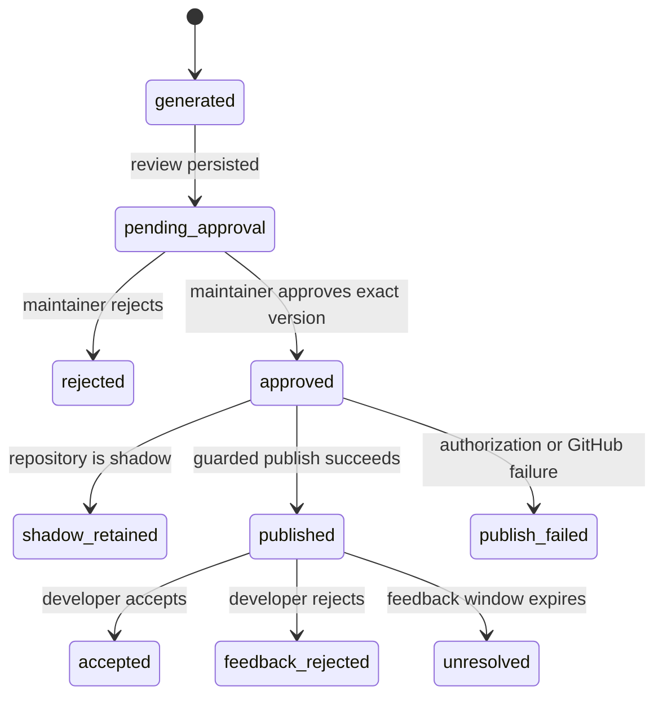

# 生产架构收敛

## 文档性质

本文描述 Review 产品主线的**目标架构合同**，不是“已经生产部署”的声明。图中绿色节点已有
本地实现或有界验证，黄色虚线节点是进入生产闭环前必须补齐的能力。Phase 9A 只冻结边界，
不实现这些新增服务。

## 目标链路

```mermaid
flowchart LR
    subgraph GH["GitHub"]
        PR["PR / synchronize event"]
        COMMENTS["Review comments"]
        DEV["Developer accept / reject"]
    end

    subgraph CONTROL["Control plane"]
        ADMIN["Organization admin<br/>repo registry · mode · budgets"]
        API["Webhook / API gateway<br/>HMAC · auth · limits"]
        IDEM["Idempotency + job database<br/>delivery · PR/head · state"]
        QUEUE["Bounded async queue"]
        APPROVAL["Maintainer approval<br/>RBAC · bound nonce · payload hash"]
        PUBLISH["GitHub publisher<br/>revalidate · fail closed"]
        FEEDBACK["Feedback service<br/>finding-version binding"]
    end

    subgraph REVIEW["Review data plane"]
        WORKER["Review worker"]
        CONTEXT["Context builder<br/>registered checkout · repo rules"]
        ENGINE["Finder → dedupe/scope → Verifier"]
        FINDINGS["Finding store<br/>evidence · status · content hash"]
        RULES["Repository rules / feedback memory<br/>versioned · aggregate · reversible"]
    end

    subgraph OBS["Measurement and audit"]
        TRACE["Canonical trace / audit<br/>redacted spans · stable errors"]
        METRICS["Metrics aggregator<br/>quality · time · reliability · cost"]
        DASH["Repository / organization dashboard"]
    end

    PR -->|"signed webhook"| API
    ADMIN -.->|"configure"| API
    ADMIN -.->|"register / shadow by default"| IDEM
    API -->|"persist before 2xx"| IDEM
    IDEM --> QUEUE
    QUEUE --> WORKER
    WORKER --> CONTEXT
    RULES -.->|"approved repo context"| CONTEXT
    CONTEXT --> ENGINE
    ENGINE --> FINDINGS
    FINDINGS -.->|"pending findings"| APPROVAL
    APPROVAL -.->|"approved exact version"| PUBLISH
    APPROVAL -.->|"rejected"| FINDINGS
    PUBLISH -.->|"review API"| COMMENTS
    COMMENTS -.-> DEV
    DEV -.->|"version-bound feedback"| FEEDBACK
    FEEDBACK -.-> FINDINGS

    API --> TRACE
    WORKER --> TRACE
    ENGINE --> TRACE
    APPROVAL -.-> TRACE
    PUBLISH -.-> TRACE
    FEEDBACK -.-> TRACE
    IDEM --> METRICS
    FINDINGS -.-> METRICS
    TRACE --> METRICS
    METRICS -.-> DASH
    METRICS -.->|"eligible aggregate"| RULES
    APPROVAL -.->|"approve rule version"| RULES

    classDef current fill:#d9ead3,stroke:#38761d,color:#1d1d1d;
    classDef target fill:#fff2cc,stroke:#bf9000,stroke-dasharray:5 5,color:#1d1d1d;
    class PR,API,IDEM,QUEUE,WORKER,CONTEXT,ENGINE,FINDINGS,TRACE current;
    class COMMENTS,DEV,ADMIN,APPROVAL,PUBLISH,FEEDBACK,RULES,METRICS,DASH target;
```



“已有”表示仓库中存在相应能力，不表示生产完备。例如当前 API 使用静态 Bearer、单进程有界
executor 和 SQLite；Finding 主要作为 Review 结果持久化，并没有独立的审批/反馈 schema。
当前 CLI 有 GitHub publish 能力且 Week 7.5 有单次 webhook 链路证据，但服务端没有远程身份与
审批绑定，所以图中的 publisher 仍整体标为目标能力。

## 当前实现与目标差距

| 层 | 当前可核验事实 | 生产主线要求 | Phase 9A 处理 |
| --- | --- | --- | --- |
| GitHub 接入 | FastAPI webhook；原始 body HMAC；仓库白名单；delivery 幂等；单次私有 draft PR live probe | GitHub App/OAuth 身份、可运营 hook、紧凑 ack、端到端 SLO | 只冻结指标和边界 |
| 异步执行 | `ReviewService` + 单进程 bounded executor；`queued -> running -> succeeded|failed` | 可恢复队列、明确 retry/attempt、容量与 backpressure | 不重构 |
| 数据库 | SQLite 保存 job、结果、diff hash/bytes，不保存 inline diff | 组织/仓库/身份、Finding 版本、审批、发布、反馈、指标 lineage | 不改 schema |
| Review 引擎 | Python diff 上下文、双 Finder、去重/scope、双 Verifier、sentinel、降级/fail-open | 冻结版本、shadow 运行、仓库策略输入、SLO 与成本门禁 | Review 保持主线，不改算法 |
| 审批 | Repair 有本地一次性审批绑定；Review 服务未暴露远程审批 | 维护者 RBAC；绑定 repo/PR/head/Finding hash 的一次性批准 | 仅定义，不复用布尔审批 |
| 发布 | CLI 可以构建/发送 GitHub review；服务不自动发布 | shadow 默认；guarded publish 逐次重验权限和 payload | 仅定义 fail-closed 边界 |
| 反馈 | 无生产 accept/reject 采集 | 绑定已发布 Finding 版本、结构化原因、成熟期 | 只定义事件与 KPI |
| 记忆 | 有静态仓库约定上下文；无业务反馈记忆 | 仓库级聚合、版本化、维护者批准、可回滚 | 禁止用户个人记忆 |
| 可观测 | `crag.observability/v1alpha1`、本地 redacted JSONL、稳定错误、tokens/部分成本 | 跨服务 trace、业务事件、完整成本、数据质量和告警 | 复用 profile，补目标事件合同 |

## 核心领域对象

### Repository policy

```text
repository_id
mode = shadow | guarded_publish
registered_checkout / installation identity
allowed_events
review_policy_version
active_rule_version
cost_budget
latency_slo
```

仓库创建时 `mode=shadow`。切换到 `guarded_publish` 是组织管理员的显式配置变更，必须审计；
切换不追溯发布 shadow 阶段的 Finding。

### Logical Review

```text
unique(repository_id, pull_request_id, head_sha, review_policy_version)
review_id
delivery_ids[]
attempts[]
primary_terminal_class
result_sha256
trace_id
```

delivery 可以多对一映射到 Review。基础设施 retry 只增加 attempt，不增加逻辑 Review；这同时是
completion、cost 和 duplicate webhook 指标的分母边界。

### Finding

```text
finding_id
review_id
fingerprint
content_sha256
path / line / severity / category
evidence references
status
```

状态机：



在 shadow 模式下，`approved` 只表示内部评估结论，不能调用 GitHub；为了避免术语混淆，事件中
同时记录 `decision=approved` 与 `publication_eligible=false`。

### Approval and publish receipt

审批必须绑定：

```text
organization_id, repository_id, pull_request_id, head_sha,
finding_ids + content hashes, approver_principal_id,
role_snapshot, policy_version, nonce, issued_at, expires_at
```

publisher 在外部调用前重验全部字段并原子消费 nonce。发布回执保存 request payload hash、GitHub
review/comment identity、HTTP outcome 和 trace ID，不保存凭据。任何字段缺失或 head 已变化都
fail closed；不能把 Repair 的本地一次性审批简化成远程 `approve=true`。

### Feedback and repository memory

反馈绑定 `finding_id + content_sha256 + published GitHub identity`。允许 `accepted/rejected` 和
结构化原因，不接受任意聊天记录作为指标输入。

仓库反馈记忆只保存聚合规则，例如：

```text
rule_id, repository_id, parent_version, source_window,
resolved_finding_count, reason_distribution,
proposed_change, offline_replay_hash,
approved_by, activated_at, rollback_to
```

单次反馈不能直接抑制未来 Finding；满足样本门槛、离线回放和维护者批准后才能激活新版本。

## 请求与故障语义

1. API 先执行流式大小限制、验签和事件/仓库检查，再执行幂等事务；无效请求在模型工作前结束。
2. job 与 delivery 映射持久化成功后才能 ack；ack 响应应紧凑，不回传完整 Review。
3. worker 从注册仓库获取精确 PR/head diff，构建有预算的 Python 上下文并执行 Review。
4. 结果和 terminal 状态原子持久化；错误使用稳定类别，不回显 diff、路径、异常或凭据。
5. degraded/fail-open 可以进入 shadow 审核，但 guarded publish 默认不允许自动获得发布资格；
   是否允许维护者强制发布必须是独立、显式、可审计的策略，Phase 9A 不授权。
6. publisher 的授权或绑定失败是 hard deny；GitHub 超时不得用盲重试制造重复 comment，必须先按
   idempotency/publish receipt 查询和对账。
7. feedback、metrics、rule update 的失败不能回滚已经发生的 GitHub publish，但必须产生可重放
   事件和告警。

## 可观测链路

沿用 `crag.observability/v1alpha1` 的 redaction 和 canonical trace，新增业务事件时保持：

- API、worker、approval、publisher、feedback 共享 `trace_id`，异步边界通过受限 trace context
  传播；
- Prompt、diff、工具参数/结果、GitHub token、反馈自由文本和主机路径不进入指标事件；
- 业务指标只引用稳定 ID、枚举、整数时间/成本和内容哈希；
- 原始 provider 成本缺失时标记 `estimated`，不能冒充账单；
- exporter 失败不改变审批或发布权限，且本地审计仍保留 degraded 证据；
- unauthorized publish、duplicate-created-job、数据完整率为强制告警，不因低流量关闭。

具体公式和空分母语义见 [`business-metrics.md`](business-metrics.md)。

## 部署边界

首个生产试点应保持单区域、少量注册仓库和 shadow 默认值，但仍需在另一个阶段完成：

- GitHub App/OAuth 与组织/仓库 RBAC；
- TLS、secret manager、数据库备份/迁移、durable queue、并发和容量测试；
- 审批/发布/反馈 schema 与 UI；
- 端到端 webhook ack、review p50/p95、成本和故障演练；
- 数据保留、删除、审计访问和隐私评审；
- guarded publish 的独立安全评审与回滚开关。

在这些条件完成前，架构只能以本地/受控 shadow 试点叙述，不能标注“生产可用”。Repair、远程
审批执行代码、A2A 和 Verifier Training 不进入这条部署关键路径。
